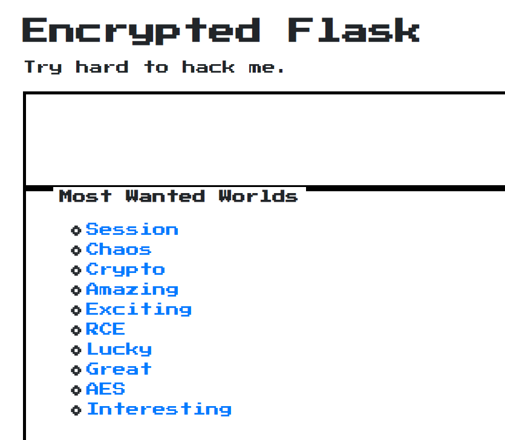

## flag
``
## session介绍
[前乌云核心白帽离别歌介绍客户端session](https://www.leavesongs.com/PENETRATION/client-session-security.html)讲的比较详细。
[session安全&&CBC字符反转攻击&&hash拓展攻击](https://www.cnblogs.com/ophxc/p/13124248.html)

在传统PHP开发中，$_SESSION变量的内容默认会被保存在服务端的一个文件中，通过一个叫“PHPSESSID”的Cookie来区分用户。这类session是“服务端session”，用户看到的只是session的名称（一个随机字符串），其内容保存在服务端。  

然而，并不是所有语言都有默认的session存储机制，也不是任何情况下我们都可以向服务器写入文件。所以，很多Web框架都会另辟蹊径，比如Django默认将session存储在数据库中，而对于flask这里并不包含数据库操作的框架，就只能将session存储在cookie中。  

因为cookie实际上是存储在客户端（浏览器）中的，所以称之为“客户端session”  
## 思路
1. 访问环境，由于题目给出flask提示，猜测通过flask session伪造实现，第一感的思路是，找到SSTI注入点获得config信息，进而获得加密秘钥key，伪造session，越权获得flag。
2. 通过测试没有发现SSTI注入点，题目hint给了密码学和逆向知识，猜测这题不能像之前那样通过任意文件读或SSTI获得密钥了，大概率是flask使用了弱加密算法。注册一个账号后，会让用户给10个选项投票，选项中也给出了提示AES。
   
3. 知道AES可能有漏洞，但还是无法做出来。建议看[Encrypted Flask官方题解](./[第三章%20web进阶]Encrypted%20Flask官方题解.md)  
同理，[第三章 web进阶unsecure converter](./scripts/Nu1L%20unsecure%20converter%20wp.zip)也看官方题解   

## 总结
到此为止，关于Nu1L战队的WEB题就已经做完了，接下来开始常规WEB训练。