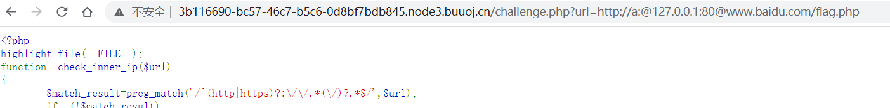
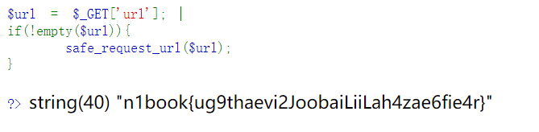

## flag
`n1book{ug9thaevi2JoobaiLiiLah4zae6fie4r}`

## 思路
1. 访问环境得到如下界面，有两处挑战`simple`和`interesting`  
   这里吐槽一下，出题人`interesting`写错了，英语有待加强
   
2. `simple`，直接根据提示输入`127.0.0.1/flag.php`获得flag
3. `interesting`，开始审计源码，不允许执行发往内网服务器的请求。源码中使用`parse_url`解析url参数检查ip是否是局域网ip，却用`curl_exec`获取实际参数，这两个函数对于url的解析不同，从而可以绕过。
`http://a:@127.0.0.1:80@www.baidu.com/flag.php`或`http://@127.0.0.1:80@www.baidu.com/flag.php`
    - `parse_url`解析到的host是www.baidu.com
    - `curl_exec`解析到的127.0.0.1
4. 结果如下  



## 总结
ssrf通常是让内网主机去访问内网特定服务器，外网主机可能没办法直接访问内网服务器。
- 利用了`curl`与`parse_url`解析url的规则不同，绕过局域网ip限制
- 注意在`127.0.0.1`上加`80`端口
- 由于ssrf发生在内网两台服务器上，可能不会再burpsuite或我们的主机界面上有回显


## 源码
```php
<?php 
highlight_file(__FILE__);
function check_inner_ip($url) 
{ 
    $match_result=preg_match('/^(http|https)?:\/\/.*(\/)?.*$/',$url); 
    if (!$match_result) 
    { 
        die('url fomat error'); 
    } 
    try 
    { 
        $url_parse=parse_url($url); 
    } 
    catch(Exception $e) 
    { 
        die('url fomat error'); 
        return false; 
    } 
    $hostname=$url_parse['host']; 
    $ip=gethostbyname($hostname); 
    $int_ip=ip2long($ip); 
    return ip2long('127.0.0.0')>>24 == $int_ip>>24 || ip2long('10.0.0.0')>>24 == $int_ip>>24 || ip2long('172.16.0.0')>>20 == $int_ip>>20 || ip2long('192.168.0.0')>>16 == $int_ip>>16; 
} 

function safe_request_url($url) 
{ 
     
    if (check_inner_ip($url)) 
    { 
        echo $url.' is inner ip'; 
    } 
    else 
    {
        $ch = curl_init(); 
        curl_setopt($ch, CURLOPT_URL, $url); 
        curl_setopt($ch, CURLOPT_RETURNTRANSFER, 1); 
        curl_setopt($ch, CURLOPT_HEADER, 0); 
        $output = curl_exec($ch); 
        $result_info = curl_getinfo($ch); 
        if ($result_info['redirect_url']) 
        { 
            safe_request_url($result_info['redirect_url']); 
        } 
        curl_close($ch); 
        var_dump($output); 
    } 
     
} 

$url = $_GET['url']; 
if(!empty($url)){ 
    safe_request_url($url); 
} 

?> 
```