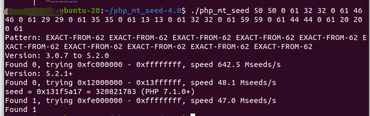
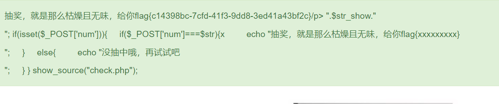

## flag
`flag{c14398bc-7cfd-41f3-9dd8-3ed41a43bf2c}`

## 思路

1. 打开页面，查看源码，得到check.php。分析源码，关键点在于mt_srand伪随机数生成函数的seed。   
```php
<?php
#这不是抽奖程序的源代码！不许看！
header("Content-Type: text/html;charset=utf-8");
session_start();
if(!isset($_SESSION['seed'])){
$_SESSION['seed']=rand(0,999999999);
}

mt_srand($_SESSION['seed']);
$str_long1 = "abcdefghijklmnopqrstuvwxyz0123456789ABCDEFGHIJKLMNOPQRSTUVWXYZ";
$str='';
$len1=20;
for ( $i = 0; $i < $len1; $i++ ){
    $str.=substr($str_long1, mt_rand(0, strlen($str_long1) - 1), 1);       
}
$str_show = substr($str, 0, 10);
echo "<p id='p1'>".$str_show."</p>";


if(isset($_POST['num'])){
    if($_POST['num']===$str){x
        echo "<p id=flag>抽奖，就是那么枯燥且无味，给你flag{xxxxxxxxx}</p>";
    }
    else{
        echo "<p id=flag>没抽中哦，再试试吧</p>";
    }
}
show_source("check.php");
```

2. 先把随机字符转为[php_mt_seed](https://www.openwall.com/php_mt_seed/php_mt_seed-4.0.tar.gz)工具可以识别的形式，利用php_mt_seed工具破解seed。  
   
```python
str1='abcdefghijklmnopqrstuvwxyz0123456789ABCDEFGHIJKLMNOPQRSTUVWXYZ'
str2='O6K39n6XIu'
length = len(str2)
res=''
for i in range(len(str2)):  
    for j in range(len(str1)):
        if str2[i] == str1[j]:
            res+=str(j)+' '+str(j)+' '+'0'+' '+str(len(str1)-1)+' '
            break
print(res)
```
3. 利用破解的seed(此处为320821783)，按照check.php的逻辑得到随机数。
```php
<?php
mt_srand(320821783);
$str_long1 = "abcdefghijklmnopqrstuvwxyz0123456789ABCDEFGHIJKLMNOPQRSTUVWXYZ";
$str='';
$len1=20;
for ( $i = 0; $i < $len1; $i++ ){
    $str.=substr($str_long1, mt_rand(0, strlen($str_long1) - 1), 1);       
}
echo "$str";
?>
```
  