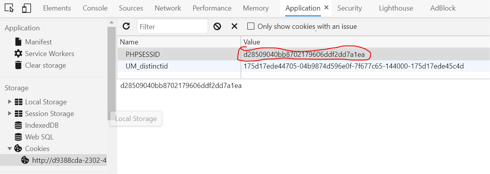
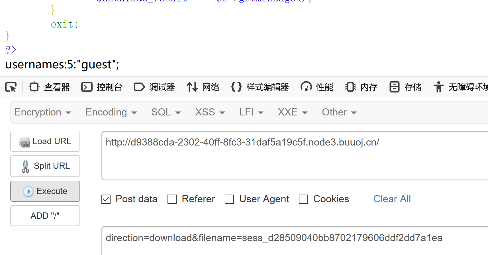
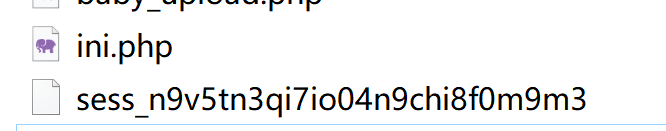
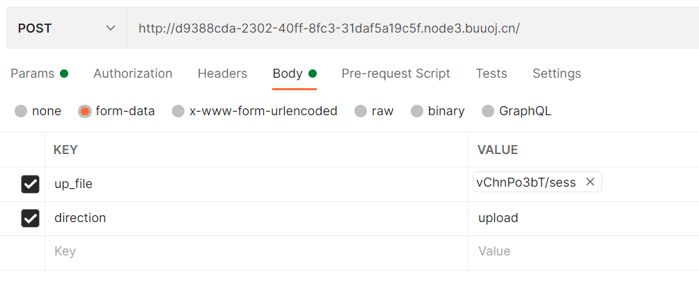
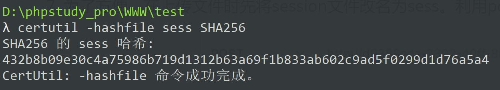
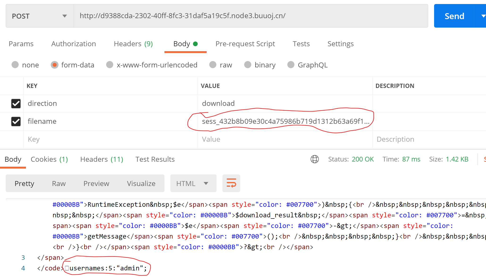
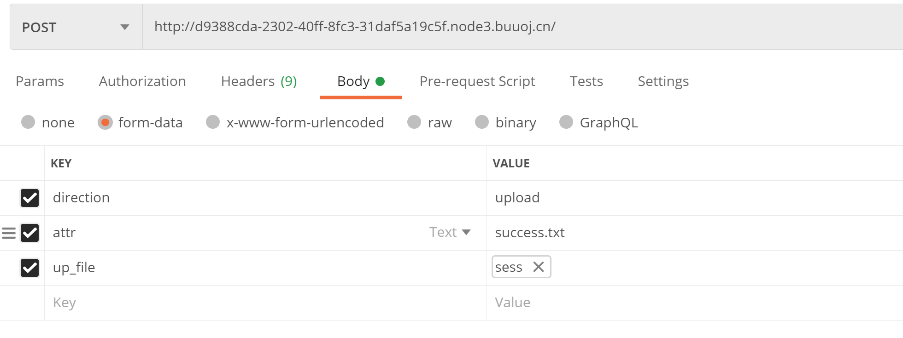
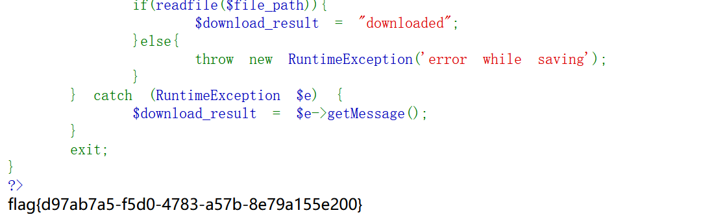

## 思路

1. 打开网页显示一段php源码，首先分析这段代码，主要分析点在于需要满足什么条件才能获取flag。

- $_SESSION['username']='admin'

- 通过file_exists('/var/babyctf/success.txt')校验。

  另外可以看到，这段代码重点有四个参数值：
  
  direction：上传/下载
  
  attr：目录名
  
  filename：访问的文件名
  
  up_file：上传的文件名

```php
<?php
error_reporting(0);
session_save_path("/var/babyctf/");//session数据存在路径
session_start();
require_once "/flag";
highlight_file(__FILE__);
if($_SESSION['username'] ==='admin')
{
    $filename='/var/babyctf/success.txt';
    if(file_exists($filename)){
            safe_delete($filename);
            die($flag);
    }
}//满足该if块条件，才能显示flag
else{
    $_SESSION['username'] ='guest';
}

$direction = filter_input(INPUT_POST, 'direction');
$attr = filter_input(INPUT_POST, 'attr');
$dir_path = "/var/babyctf/".$attr;
if($attr==="private"){
    $dir_path .= "/".$_SESSION['username'];
}

```

当direction为upload时，执行上传文件的操作

上传的文件会改名为(filename)_文件sha256值

```php
if($direction === "upload"){
    try{
        if(!is_uploaded_file($_FILES['up_file']['tmp_name'])){
            throw new RuntimeException('invalid upload');
        }
        $file_path = $dir_path."/".$_FILES['up_file']['name'];
        $file_path .= "_".hash_file("sha256",$_FILES['up_file']['tmp_name']);//将上传的文件重命名
        //防止目录穿越
        if(preg_match('/(\.\.\/|\.\.\\\\)/', $file_path)){
            throw new RuntimeException('invalid file path');
        }
        @mkdir($dir_path, 0700, TRUE);
        if(move_uploaded_file($_FILES['up_file']['tmp_name'],$file_path)){
            $upload_result = "uploaded";
        }else{
            throw new RuntimeException('error while saving');
        }
    } catch (RuntimeException $e) {
        $upload_result = $e->getMessage();
    }
} 
```

当direction为download时，使用readfile()函数读取文件内容。

> basename()  返回路径中的文件名部分
>
> readfile()  读取一个文件并写入到输出缓冲

```php
elseif ($direction === "download") {
    try{
        $filename = basename(filter_input(INPUT_POST, 'filename'));
        $file_path = $dir_path."/".$filename;
        if(preg_match('/(\.\.\/|\.\.\\\\)/', $file_path)){
            throw new RuntimeException('invalid file path');
        }
        if(!file_exists($file_path)) {
            throw new RuntimeException('file not exist');
        }
        header('Content-Type: application/force-download');
        header('Content-Length: '.filesize($file_path));
        header('Content-Disposition: attachment; filename="'.substr($filename, 0, -65).'"');
        if(readfile($file_path)){
            $download_result = "downloaded";
        }else{
            throw new RuntimeException('error while saving');
        }
    } catch (RuntimeException $e) {
        $download_result = $e->getMessage();
    }
    exit;
}
?>
```

2. $_SESSION

> 在PHP中，使用$_SESSION[]可以存储特定用户的Session信息。
>
> 并且每个用户的Session信息都是不同的。
>
> 当用户请求网站中任意一个页面时，若用户未建立Session对象，则服务器会自动为用户创建一个Session对象，它包含唯一的SessionID和其他Session变量，并保存在服务器内存中，不同用户的Session对象存着各自指定的信息。
>
> Session信息的存储与读取
>
> **session_save_path(path)**:指定当前会话的保存路径。
>
> **session_start();** //开启Session功能
>
> **session_id();**//获取用户Session ID值，如需修改在括号中传值即可
>
> 利用Session变量**存储**信息：
> $_SESSION["Session名称"]=变量或字符串信息;
>
> **读取**Session变量信息（可赋值给一个变量或者直接输出）：
> 变量=$_SESSION["Session名称"];

分析上面的第一段代码可以看出题目指定的上传和下载目录与存放session数据文件的目录相同。

因此思路就比较清晰了，我们可以**通过向系统上传自制的session文件**，使得$_SESSION['username']=admin。

另外再向系统上传一个success.txt文件，从而满足获取flag时的条件。

3. php的session文件

> 通常php在使用session时，会首先调用session_start()函数，开启 session, 将会生成一个 session_id, 通过 http 响应头返回给浏览器, 浏览器存储到本地的 cookie 中, 下次 http 请示会自动携带给服务端; 同时会在服务端生成一个文件 如sess_2rh6hq44kjbtagri2r88dj16b1 (后面一串为 **session_id**，通常为cookie中PHPSESSID的值), 当前会话(通过 id保持) 的数据, 会保存在该文件中, 如 session('name', 'test')
>
>
> 在结束会话时，会调用session_unset()，注销当前会话下的 session 变量, 但不会删除当前 sess_xxxx... 文件, 而是清空文件里的内容(key: value)

4. 因此，我们可以先利用direction=download，查看一下当前服务端的session文件里面的值，按照第一段的逻辑，应该已经将

$_SESSION['username'] 设为'guest'。在服务端，session文件的文件名应为sess_PHPSESSID，



因此应POST的参数为：`direction=download&filename=sess_d28509040bb8702179606ddf2dd7a1ea`



可以看到页面上返回了usernames:5:"guest";可以判断采用了`php_binary`的序列化方式

5. 我们在本地创建php文件，生成session文件。  
    这里注意`session.serialize_handler`定义用来序列化/反序列化的处理器名字。默认使用php  
    1. `php_binary`:存储方式是，键名的长度对应的ASCII字符+键名+经过serialize()函数序列化处理的值
    2. `php`:存储方式是，键名+竖线+经过serialize()函数序列处理的值
    3. `php_serialize`(php>5.5.4):存储方式是，经过serialize()函数序列化处理的值  
    以`$_SESSION['username']='admin'`为例，三种不同的`session.serialize_handler`参数，获得的sess_{PHPSESSID}文件内容不一样
    ```
    usernames:5:"admin";
    username|s:5:"admin";
    a:1:{s:8:"username";s:5:"admin";}
    ```
```php
<?php
ini_set('session.serialize_handler', 'php_binary');
session_save_path("D:\\phpstudy_pro\\WWW\\testphp\\"); //本地保存目录
session_start();
$_SESSION['username'] = 'admin';
?>
```

​	该文件运行后，会在目录下生成一个sess_文件，可以查看sess中内容，如下：




6. 此时就只需要将生成的sess文件上传到服务端，替换原有的sess文件，然后前端解析时$_SESSION['username'] 即为admin，满足了获取flag的第一个条件。

7. 为了方便，在上传文件时先将session文件改名为sess。利用**postman**进行post请求上传文件。

   

8. 文件上传后会被重命名（上面的第二段代码），在原有的文件名基础上加上文件的sha256值，因此还需要获取文件的sha256值。

   利用cmd自带的certutil即可计算  `certutil -hashfile 文件名 SHA256 `



9. 可以验证一下是否上传成功。

   可以看到返回结果显示username已经变成admin了。

   

10. 此时再想办法满足条件file_exists('/var/babyctf/success.txt')

    > file_exists() 函数检查文件或目录是否存在。

    前面已经提过，如果直接上传文件，文件名会被重命名，这样直接是无法通过该条件判断的。

    另外题目还给了一个attr参数，因此可以使attr=success.txt，创建目录，因此就存在一个/var/babyctf/success.txt目录，就可以满足上面的条件。

    

11. 此时再将浏览器中Cookie的PHPSESSID修改为sess文件的SHA256值即可。

​	   再刷新页面即可获取到flag。

​	

## 总结

1. 本题重点在于对题目给出的php进行分析，弄清楚获取flag需要满足的条件。
2. php的$_SESSION原理要了解。对于php使用的SESSION，会在服务端生成一个`sess_{PHPSESSID}`文件存储序列化后的session值。
3. 生成序列化session的方式有三种，`session.serialize_handler`定义用来序列化/反序列化的处理器名字。默认使用php  
    1. `php_binary`:键名的长度对应的ASCII字符+键名+经过serialize()函数序列化处理的值
    2. `php`:键名+竖线+经过serialize()函数序列处理的值
    3. `php_serialize`(php>5.5.4):经过serialize()函数序列化处理的值   
    以`$_SESSION['username']='admin'`为例，三种不同的`session.serialize_handler`参数，获得的sess_{PHPSESSID}文件内容不一样
    ```
    usernames:5:"admin";
    username|s:5:"admin";
    a:1:{s:8:"username";s:5:"admin";}
    ```
4. 通过download接口，获取guest用户的session序列化内容，判断序列化方法为`php_binary`，利用upload接口的`filename_SHA256`伪造session文件。
5. 浏览器中Cookie的PHPSESSID值为`sess_{PHPSESSID}`文件hash值(具体hash算法根据后端来定义)。
6. 注意不要看到success.txt就意味是文件，也可以是一个目录名。
7. flask的session计算方法可以参考题目[第一章 web入门 afr-3](../N1BOOK/[第一章%20web入门]afr-3.md)