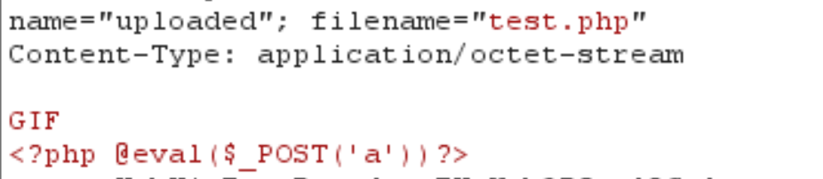
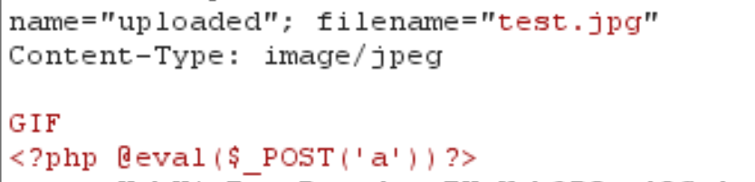

## 思路

1. 打开题目即是提示上传文件，首先还是尝试最简单的一句话木马的php文件，不出意料不能上传，尝试修改Content-type和文件后缀名，发现php3,php4,php5,phtml,phar这些文件名都不能被上传。

   

   

2. 上传jpg文件，可以成功上传，并且页面会显示上传后的路径。

   

   

3. 服务器不会将jpg文件当成php脚本来解析，此时就需要配置文件的辅助，人为设置，使得jpg文件也能像php文件一样执行。如题目一样，有两种方法，即上传.user.ini和上传.htaccess。

   尝试上传.user.ini，但无法判断上传目录中是否存在其他php文件。

   本题使用.htaccess，表示将文件名为test的文件解析为php执行。

   ```
   <FilesMatch "test">
   SetHandler application/x-httpd-php
   </FilesMatch>
   ```

4. 然后再利用蚁剑连接上传的jpg文件即可。


## 总结

本题考查的是文件上传的基本思路：

- 上传jpg文件和配置文件，设置jpg文件为可执行的php类文件。