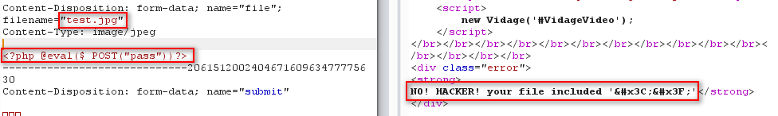
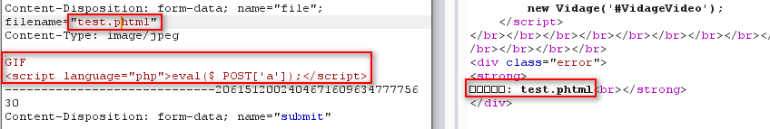
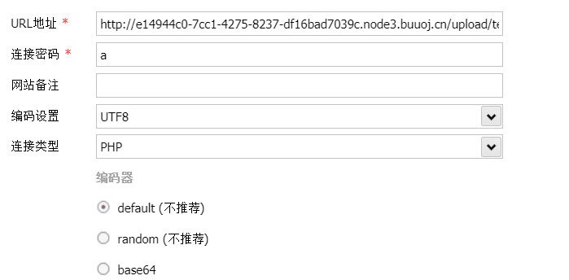
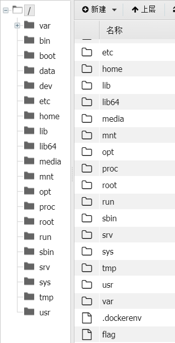
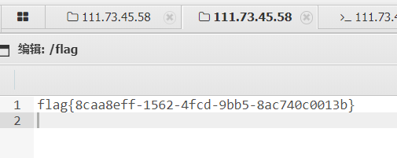

## 思路

1. 上传最基本的一句话木马，

​	test.php   `<?php @eval($_POST('test'))?>`

查看返回结果显示Not image，说明后端对文件后缀名有检查。

将该后缀改为jpg，又会显示文件内容检查出<?。说明后端对文件内容有检查，不能php脚本，同时有可能后端会检查图片文件头，所以在构造的木马最前面加上GIF。

经测试后，将上传文件改为test.phtml  ，即可上传成功。

 `GIF  `

2. 此时文件已经成功上传到服务器，然后就需要找文件上传到哪个目录，一般是upload目录，经测试本题也是。所以就可以利用蚁剑/菜刀连接上传的test.phtml。

   

3. 连接上服务器之后，即可在根目录下找到flag文件 。

​	有比较多的题目都是直接在根目录下就可以找到flag，但适用性更广的方法即是在蚁剑中打开终端，利用**find命令**搜索flag文件，`find / -name flag`，然后利用cat获得flag内容。

## 总结

- 本题在后端禁止的上传文件特征主要为：
  - 后缀名为php（黑名单）
  - 文件内容含有<?
  - 文件没有图片文件的特征（文件头）

- 因此相应的绕过方法为：
  - 使用其他可以在php中执行的文件后缀（phtml）
  - 脚本采用``
  - 文件头加上GIF

