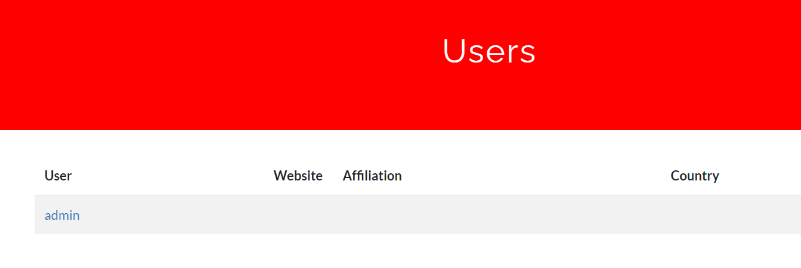
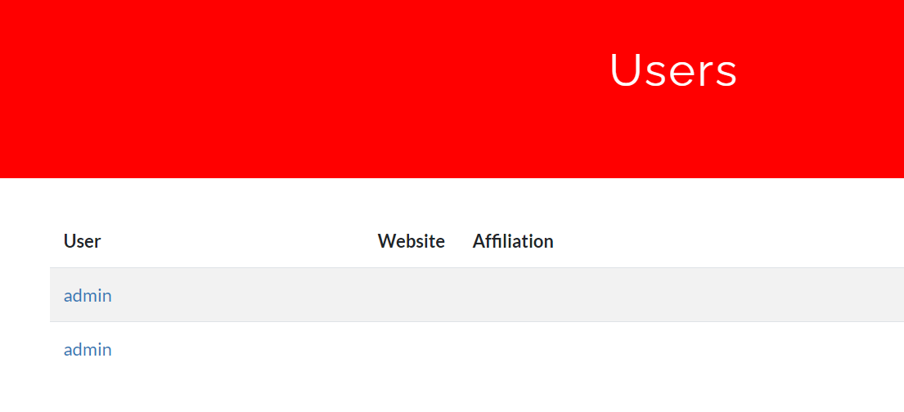
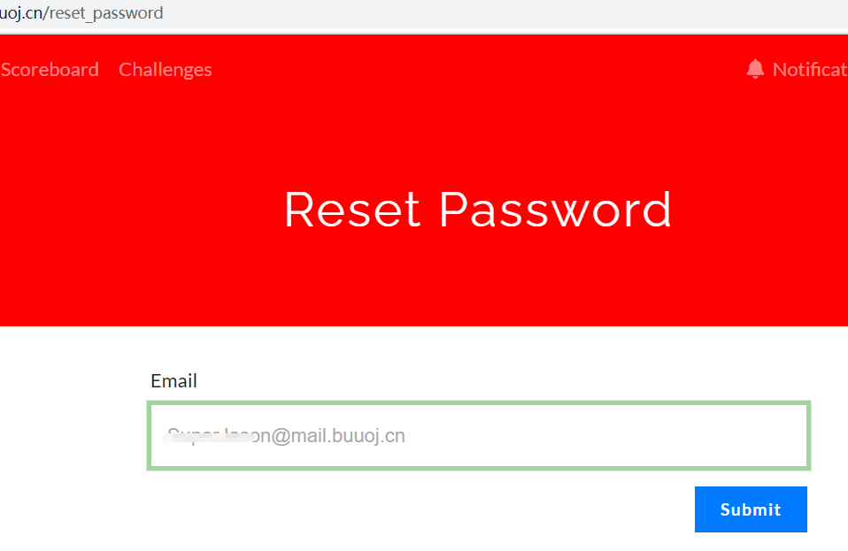
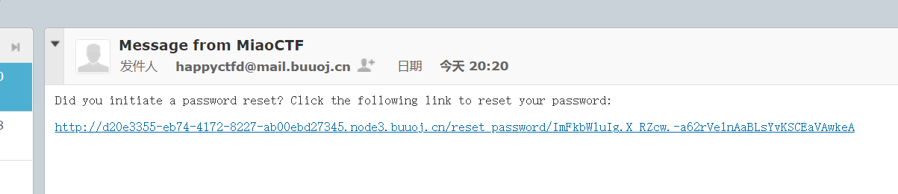
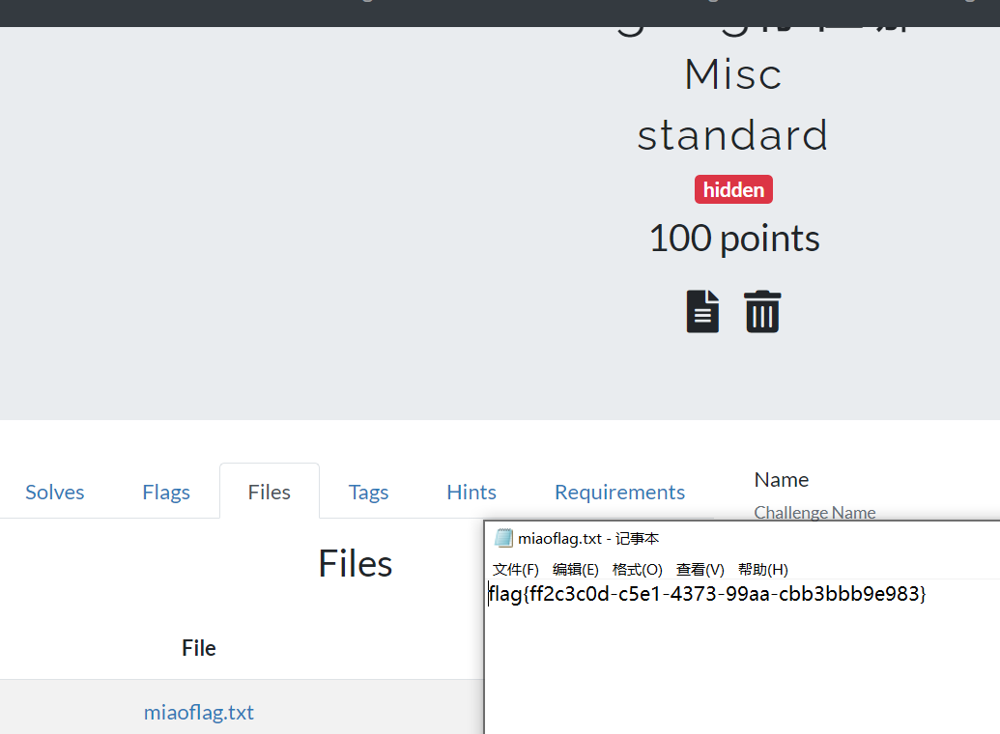

## flag
`flag{ff2c3c0d-c5e1-4373-99aa-cbb3bbb9e983}`
## 背景
由于最近在搭建CTFd平台，google的时候找到了`CTFd v2.0.0-v2.2.2`的任意账户接管漏洞`CVE-2020-7245`，正好BUUCTF上有一道CTFd的题目，Start。

## 思路
1. 漏洞位于`CTFd/auth.py`的register函数，注册前后处理不一致。`Users.query.add_columns('name', 'id').filter_by(name=name).first()`对name进行处理，`name=name.strip()`对经过空白字符过滤后的name进行处理，导致我们可以在任意账户前后加空格绕过验证，这里以admin为例子。   
```python
def register():
    errors = get_errors()
    if request.method == 'POST':
        name = request.form['name']
        email_address = request.form['email']
        password = request.form['password']

        name_len = len(name) == 0
        names = Users.query.add_columns('name', 'id').filter_by(name=name).first()
        emails = Users.query.add_columns('email', 'id').filter_by(email=email_address).first()
        pass_short = len(password) == 0
        pass_long = len(password) > 128
        valid_email = validators.validate_email(request.form['email'])
        team_name_email_check = validators.validate_email(name)

        if not valid_email:
            errors.append("Please enter a valid email address")
         ..........

        if len(errors) > 0:
            return render_template(
                'register.html',
                errors=errors,
                name=request.form['name'],
                email=request.form['email'],
                password=request.form['password']
            )
        else:
            with app.app_context():
                user = Users(
                    name=name.strip(),
                    email=email_address.lower(),
                    password=password.strip()
                )
```   
2. 打开ctfd平台，用户界面只有一个admin账户，猜测是修改admin账户的密码，登录后拿到flag。  
   
3. 在[BUUOJ邮箱](http://mail.buuoj.cn/admin/ui/user/signup/mail.buuoj.cn)注册一个邮箱。通过这个邮箱去注册ctfd的加空格` admin `账户，此时user变为两个admin。  
   
4. 接下来需要找到重置密码的地方，根据auth.py文件，`/reset_password`接口可以重置密码。这里flask也是用的反序列化去获得用户名，反序列化NB。    
   
```python
@auth.route('/reset_password', methods=['POST', 'GET'])
@auth.route('/reset_password/<data>', methods=['POST', 'GET'])
@ratelimit(method="POST", limit=10, interval=60)
def reset_password(data=None):
    if data is not None:
        try:
            name = unserialize(data, max_age=1800)
        except (BadTimeSignature, SignatureExpired):
            return render_template('reset_password.html', errors=['Your link has expired'])
        except (BadSignature, TypeError, base64.binascii.Error):
            return render_template('reset_password.html', errors=['Your reset token is invalid'])

```
5. 这里注意邮箱账号必须是小写才能收到邮件，大写的账户收不到邮件，但是又可以注册，这里算是本人新发现的一个点，但好像并没有什么可以深入的漏洞点。  
   
6. 登录管理员界面，获得flag   
   

## 总结
从搭建CTF的到发现已有`CVE-2020-7245`，借助BUUCTF平台正好完成一道任意账户接管漏洞题目，整理一下攻击链。
- `CTFd/auth.py`文件的注册函数部分，添加用户名是直接用的`name`加入到数据库，但实际生成用户的时候是`name=name.strip(),email=email_address.lower(),password=password.strip()`。
- 在name前后加空格，可以注册新用户` admin `，已登录账户发起重置密码请求，实际修改的是admin的密码。
- 通过新密码登录admin账户，拿到管理权限。
在渗透测试的过程中，一些细小的差异点，可以是能否挖掘到漏洞的关键，例如本题的admin账户前后加空格、邮箱账号小写发送等。